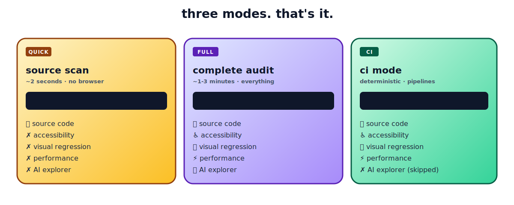

<div align="center">

<br />

<pre>
        ╱|、
      (˚ˎ 。7
       |、˜〵
       じしˍ,)ノ

      <b>s n i f f</b>
</pre>

### One command. Five checks. Zero config.

Source bugs · Accessibility · Visual regression · Performance · AI exploration

[](https://www.npmjs.com/package/sniff-qa)
[](LICENSE)
[](https://nodejs.org)
[](https://github.com/Aboudjem/sniff/actions/workflows/ci.yml)

</div>

<br />

## Run it

```bash
npx sniff-qa
```

That's the whole tutorial. Source scan completes in seconds.

For the full audit, point Sniff at your running app:

```bash
npx sniff-qa --url http://localhost:3000
```

This runs source scan + accessibility (axe-core) + visual regression (pixelmatch) + performance (Lighthouse) + AI chaos monkey exploration. Everything in one pass.

<br />

## The three commands

<div align="center">



</div>

```bash
npx sniff-qa                                   # quick scan (no browser)
npx sniff-qa --url http://localhost:3000       # full audit (everything)
npx sniff-qa --url http://localhost:3000 --ci  # ci mode (skips AI explorer)
```

That's the whole CLI. **CI mode** auto-skips the AI explorer because it's non-deterministic.

> [!TIP]
> Drop the URL in `sniff.config.ts` once and you can just run `sniff` for the full audit.

<br />

## What it checks

<table>
<tr>
<td width="50%" valign="top">

**📄 Source code**

```
! HIGH (3)
  src/api/handler.ts:42    Debugger statement
  src/components/Hero.tsx:8 Lorem ipsum text
  src/utils/auth.ts:15     FIXME comment
```

Leftover `debugger`, placeholder text, hardcoded URLs, broken imports, TODO/FIXME tags.

</td>
<td width="50%" valign="top">

**♿ Accessibility** ([axe-core](https://github.com/dequelabs/axe-core))

```
! CRITICAL
  /login  Missing form label
  /login  Color contrast 2.1:1 (needs 4.5:1)
```

WCAG 2.x violations with exact fix guidance.

</td>
</tr>
<tr>
<td valign="top">

**🖼 Visual regression** ([pixelmatch](https://github.com/mapbox/pixelmatch))

```
! HIGH
  /pricing  2.3% pixels changed
            (threshold: 0.1%)
```

Local pixel diffing. Commit baselines to track UI changes across PRs.

</td>
<td valign="top">

**⚡ Performance** ([Lighthouse](https://developer.chrome.com/docs/lighthouse))

```
! HIGH
  /dashboard  LCP 4200ms
              budget 2500ms (68% over)
```

Defaults: LCP 2500ms, FCP 1800ms, TTI 3800ms.

</td>
</tr>
<tr>
<td colspan="2" valign="top">

**🤖 AI explorer**

```
! HIGH
  /signup  Console error filling email with: <script>alert(1)</script>
           TypeError: Cannot read property 'trim' of undefined
```

Roams your app, fills forms with adversarial inputs (XSS, SQL injection, Unicode), reports crashes. Action trace saved to `.sniff/exploration-<timestamp>.json`.

</td>
</tr>
</table>

<br />

## Install

```bash
npm install -D sniff-qa
```

```json
{
  "scripts": {
    "qa": "sniff --url http://localhost:3000"
  }
}
```

Then run `npm run qa`. Requires Node.js 22+. Playwright browsers install automatically the first time.

<br />

## All commands

```
sniff                       quick scan (source only)
sniff --url <url>           full audit (everything)
sniff --url <url> --ci      ci mode (no AI explorer)

sniff init                  scaffold sniff.config.ts
sniff ci                    generate .github/workflows/sniff.yml
sniff report                show last results
sniff update-baselines      accept current screenshots as baselines
```

### Flags (all optional)

| Flag | Effect |
|:--|:--|
| `--no-explore` | Skip AI explorer in full mode |
| `--no-browser` | Force source-only even when URL is set |
| `--max-steps <n>` | Cap exploration steps (default: 50) |
| `--no-headless` | Show the browser window |
| `--format html,json,junit` | Choose report formats |
| `--fail-on critical,high` | Severities that exit non-zero |
| `--track-flakes` | Enable flakiness detection |
| `--json` | Machine-readable output |

<br />

## Configuration

Optional. Drop `sniff.config.ts` in your project root:

```typescript
import { defineConfig } from 'sniff-qa';

export default defineConfig({
  browser: {
    baseUrl: 'http://localhost:3000',
  },
  viewports: [
    { name: 'mobile', width: 375, height: 667 },
    { name: 'desktop', width: 1280, height: 720 },
  ],
  performance: {
    budgets: { lcp: 2500, fcp: 1800, tti: 3800 },
  },
  visual: { threshold: 0.1 },
  exploration: { maxSteps: 50 },
  flakiness: { windowSize: 5, threshold: 3 },
});
```

<br />

## CI integration

```bash
npx sniff-qa ci
```

Generates `.github/workflows/sniff.yml` with Playwright caching, JUnit output, flakiness quarantine, and report artifacts.

**Flakiness quarantine.** Tests that fail 3 of 5 runs get quarantined. They still run, still appear in reports, but won't block your pipeline.

<br />

## Use with your AI editor

Sniff ships an MCP server. Pick your tool and copy the snippet.

<details>
<summary><b>Claude Code</b></summary>

```bash
claude mcp add sniff-qa npx sniff-qa --mcp
```

Or `.mcp.json`:

```json
{
  "mcpServers": {
    "sniff-qa": { "command": "npx", "args": ["sniff-qa", "--mcp"] }
  }
}
```

</details>

<details>
<summary><b>Cursor</b></summary>

`~/.cursor/mcp.json` or `.cursor/mcp.json`:

```json
{
  "mcpServers": {
    "sniff-qa": {
      "type": "stdio",
      "command": "npx",
      "args": ["sniff-qa", "--mcp"]
    }
  }
}
```

</details>

<details>
<summary><b>Windsurf</b></summary>

`~/.codeium/windsurf/mcp_config.json`:

```json
{
  "mcpServers": {
    "sniff-qa": { "command": "npx", "args": ["sniff-qa", "--mcp"] }
  }
}
```

</details>

<details>
<summary><b>Codex CLI</b></summary>

```bash
codex mcp add sniff-qa --command "npx sniff-qa --mcp"
```

</details>

<details>
<summary><b>Gemini CLI</b></summary>

`~/.gemini/mcp_config.json`:

```json
{
  "mcpServers": {
    "sniff-qa": { "command": "npx", "args": ["sniff-qa", "--mcp"] }
  }
}
```

</details>

<details>
<summary><b>Continue.dev</b></summary>

`.continue/mcpServers/sniff-qa.yaml`:

```yaml
mcpServers:
  sniff-qa:
    command: npx
    args: [sniff-qa, --mcp]
    type: stdio
```

</details>

Once configured, ask: *"Scan this project for issues"* or *"Check accessibility on localhost:3000"*.

**Tools exposed:** `sniff_scan` (source), `sniff_run` (browser), `sniff_report` (last results).

<br />

## Built on

[Playwright](https://playwright.dev) · [axe-core](https://github.com/dequelabs/axe-core) · [Lighthouse](https://developer.chrome.com/docs/lighthouse) · [pixelmatch](https://github.com/mapbox/pixelmatch) · [Zod](https://zod.dev) · [MCP SDK](https://github.com/modelcontextprotocol/typescript-sdk)

<br />

## Compared to

|  | **Sniff** | Lighthouse CI | Pa11y | BackstopJS |
|:--|:--:|:--:|:--:|:--:|
| Source scanning | ✅ | | | |
| Accessibility | ✅ | partial | ✅ | |
| Visual regression | ✅ | | | ✅ |
| Performance | ✅ | ✅ | | |
| AI exploration | ✅ | | | |
| Flakiness quarantine | ✅ | | | |
| Single command | ✅ | | | |
| MCP server | ✅ | | | |

<br />

## Contributing

Easiest way in: **add a source rule.** Each rule is a regex pattern with a severity level in `src/scanners/source/rules/`. See [CONTRIBUTING.md](CONTRIBUTING.md).

<br />

## License

[Apache 2.0](LICENSE)

---

<div align="center">

Built by [**Adam Boudj**](https://github.com/Aboudjem) · [Open an issue](https://github.com/Aboudjem/sniff/issues) · [Star the repo](https://github.com/Aboudjem/sniff)

</div>
