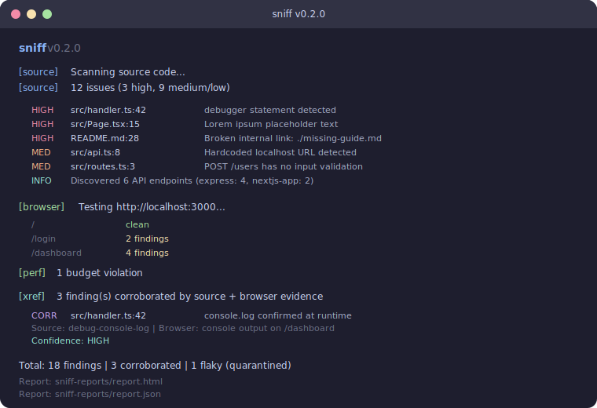
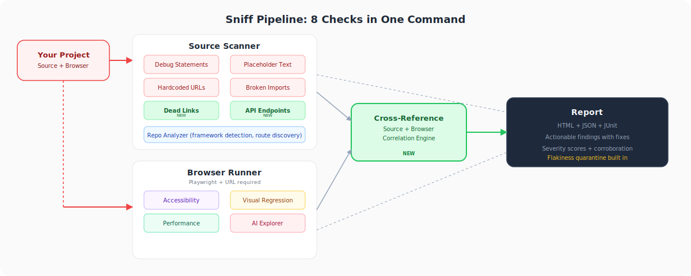
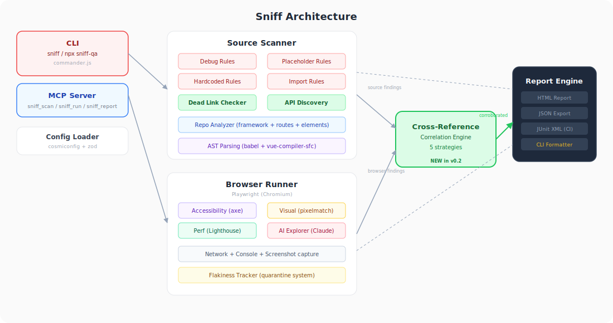

<picture>
  <source media="(prefers-color-scheme: dark)" srcset=".github/assets/logo-dark.svg">
  <source media="(prefers-color-scheme: light)" srcset=".github/assets/logo-light.svg">
  
</picture>

<p align="center">
  <a href="https://www.npmjs.com/package/sniff-qa"></a>
  <a href="LICENSE"></a>
  <a href="https://github.com/Aboudjem/sniff/actions/workflows/ci.yml"></a>
  <a href="https://nodejs.org"></a>
  <a href="https://github.com/Aboudjem/sniff/stargazers"></a>
</p>

<p align="center">Scan your source code, your live site, or both. Finds bugs before your users do.</p>

---

## Get started

### Use from the terminal

```bash
cd ~/projects/my-app    # go to your project
npx sniff-qa            # scan source code
```

Add `--url` to also check your running app (localhost, staging, or production):

```bash
npx sniff-qa --url http://localhost:3000    # local dev server
npx sniff-qa --url https://myapp.com        # or any live URL
```

### Use from your AI editor

Sniff ships as an MCP server. Add it to your editor, then ask your AI to scan.

<details>
<summary><b>Claude Code</b></summary>

```bash
claude mcp add sniff-qa npx sniff-qa --mcp
```
</details>

<details>
<summary><b>Cursor</b></summary>

Add to `~/.cursor/mcp.json`:
```json
{ "mcpServers": { "sniff-qa": { "type": "stdio", "command": "npx", "args": ["sniff-qa", "--mcp"] } } }
```
</details>

<details>
<summary><b>VS Code + Copilot</b></summary>

Add to `.vscode/mcp.json`:
```json
{ "servers": { "sniff-qa": { "type": "stdio", "command": "npx", "args": ["-y", "sniff-qa", "--mcp"] } } }
```
</details>

<details>
<summary><b>Codex CLI</b></summary>

```bash
codex mcp add sniff-qa -- npx -y sniff-qa --mcp
```
</details>

<details>
<summary><b>Windsurf</b></summary>

Add to `~/.codeium/windsurf/mcp_config.json`:
```json
{ "mcpServers": { "sniff-qa": { "command": "npx", "args": ["sniff-qa", "--mcp"] } } }
```
</details>

<details>
<summary><b>Gemini CLI</b></summary>

Add to `~/.gemini/mcp_config.json`:
```json
{ "mcpServers": { "sniff-qa": { "command": "npx", "args": ["sniff-qa", "--mcp"] } } }
```
</details>

<details>
<summary><b>Continue.dev</b></summary>

Add to `.continue/mcpServers/sniff-qa.yaml`:
```yaml
mcpServers:
  sniff-qa: { command: npx, args: [sniff-qa, --mcp], type: stdio }
```
</details>

<details>
<summary><b>OpenClaw</b></summary>

```bash
clawhub install sniff-qa
```
</details>

Then ask: *"Scan this project for issues"* or *"Check accessibility on localhost:3000"*

**MCP tools:** `sniff_scan` (source) · `sniff_run` (browser) · `sniff_report` (results)

### Install as a dev dependency

```bash
npm install -D sniff-qa
```

```json
{
  "scripts": {
    "qa": "sniff",
    "qa:full": "sniff --url http://localhost:3000"
  }
}
```

Requires Node.js 22+. Playwright installs automatically on first browser scan.

---

## Usage

```bash
npx sniff-qa                                        # scan source code
npx sniff-qa --url http://localhost:3000             # scan source + live site
npx sniff-qa ./path/to/project                      # scan a specific directory
npx sniff-qa ./path/to/project --url https://app.com # scan dir + live site
npx sniff-qa --url http://localhost:3000 --ci        # CI mode (JUnit, no AI)
```

---

## What it finds

<picture>
  <source media="(prefers-color-scheme: dark)" srcset=".github/assets/features-dark.svg">
  <source media="(prefers-color-scheme: light)" srcset=".github/assets/features-light.svg">
  
</picture>

**Source checks** run on every scan. **Browser checks** activate when you pass `--url`.

---

## Example output

<picture>
  <source media="(prefers-color-scheme: dark)" srcset=".github/assets/report-dark.svg">
  <source media="(prefers-color-scheme: light)" srcset=".github/assets/report-light.svg">
  
</picture>

---

## Commands

```
sniff                              Scan source code
sniff --url <url>                  Scan source + test live site
sniff --url <url> --ci             Full audit for CI pipelines
sniff <path>                       Scan a specific directory
sniff init                         Create sniff.config.ts
sniff ci                           Generate GitHub Actions workflow
sniff report                       Show last scan results
sniff update-baselines             Accept current visual baselines
```

<details>
<summary><b>All flags</b></summary>

| Flag | What it does |
|:-----|:-------------|
| `--url <url>` | Enable browser checks (accessibility, visual, performance, AI) |
| `--ci` | CI mode: skip AI explorer, add JUnit output, track flaky tests |
| `--no-explore` | Browser checks without AI explorer |
| `--no-browser` | Source only even if `--url` is set |
| `--max-steps <n>` | Limit AI explorer steps (default: 50) |
| `--no-headless` | Show the browser window |
| `--format html,json,junit` | Choose report formats |
| `--fail-on critical,high` | Severities that cause non-zero exit |
| `--track-flakes` | Track test flakiness across runs |
| `--json` | JSON output for scripts |

</details>

---

## Works with any stack

Sniff auto-detects your framework. No config needed.

<table>
<tr>
<td align="center" width="14%"><b>React</b><br/><sub>JSX / TSX</sub></td>
<td align="center" width="14%"><b>Next.js</b><br/><sub>App + Pages</sub></td>
<td align="center" width="14%"><b>Vue</b><br/><sub>SFC</sub></td>
<td align="center" width="14%"><b>Svelte</b><br/><sub>Components</sub></td>
<td align="center" width="14%"><b>Angular</b><br/><sub>Templates</sub></td>
<td align="center" width="14%"><b>Express</b><br/><sub>Routes</sub></td>
<td align="center" width="14%"><b>Vanilla</b><br/><sub>HTML / CSS</sub></td>
</tr>
</table>

API discovery also supports **Fastify**, **Hono**, **tRPC**, and **GraphQL**.

---

## Configuration

Sniff works with zero config. Only create a config file if you want to customize.

```bash
npx sniff-qa init
```

<details>
<summary><b>sniff.config.ts reference</b></summary>

```typescript
import { defineConfig } from 'sniff-qa';

export default defineConfig({
  // Save your URL so you can just run `sniff`
  browser: { baseUrl: 'http://localhost:3000' },

  // Viewports to test
  viewports: [
    { name: 'mobile', width: 375, height: 667 },
    { name: 'desktop', width: 1280, height: 720 },
  ],

  // Performance budgets (ms)
  performance: { budgets: { lcp: 2500, fcp: 1800, tti: 3800 } },

  // Visual regression threshold (0-1)
  visual: { threshold: 0.1 },

  // AI explorer
  exploration: { maxSteps: 50 },

  // Dead link checker
  deadLinks: {
    checkExternal: true,
    timeout: 5000,
    retries: 2,
    ignorePatterns: [],
    maxConcurrent: 10,
  },

  // API endpoint discovery
  apiEndpoints: {
    checkErrorHandling: true,
    checkValidation: true,
    checkAuth: true,
    checkSecrets: true,
    frameworks: [],          // empty = auto-detect all
  },

  // Turn off specific rules
  rules: {
    'debug-console-log': 'off',
  },
});
```

</details>

<details>
<summary><b>All rule IDs</b></summary>

| Rule | Severity | What it checks |
|:-----|:---------|:---------------|
| `debug-console-log` | medium | console.log/debug/info |
| `debug-debugger` | high | debugger statements |
| `placeholder-lorem` | high | Lorem ipsum text |
| `placeholder-todo` | medium | TODO comments |
| `placeholder-fixme` | high | FIXME comments |
| `placeholder-tbd` | medium | TBD markers |
| `hardcoded-localhost` | medium | localhost URLs |
| `hardcoded-127` | medium | 127.0.0.1 URLs |
| `broken-import` | medium | Unresolved imports |
| `dead-link-internal` | high | Broken file links |
| `dead-link-external` | medium | 404 external URLs |
| `dead-link-anchor` | medium | Missing anchors |
| `api-no-error-handling` | medium | Routes without try/catch |
| `api-no-validation` | medium | POST/PUT without validation |
| `api-no-auth` | low | Routes without auth |
| `api-hardcoded-secret` | critical | Hardcoded API keys |

Set any to `'off'` to disable.

</details>

---

## CI integration

```bash
npx sniff-qa ci
```

Generates `.github/workflows/sniff.yml` with Playwright caching, JUnit output, and report artifacts.

**Flakiness quarantine:** Tests that fail 3 of 5 runs get quarantined. They still run, still report, but won't block your pipeline.

---

## How it works

<picture>
  <source media="(prefers-color-scheme: dark)" srcset=".github/assets/pipeline-dark.svg">
  <source media="(prefers-color-scheme: light)" srcset=".github/assets/pipeline-light.svg">
  
</picture>

<details>
<summary><b>Architecture</b></summary>

<picture>
  <source media="(prefers-color-scheme: dark)" srcset=".github/assets/architecture-dark.svg">
  <source media="(prefers-color-scheme: light)" srcset=".github/assets/architecture-light.svg">
  
</picture>

</details>

---

## Privacy

No telemetry. No signup. No data collection. Your code stays on your machine.

> [!NOTE]
> The AI explorer needs an Anthropic API key. Everything else works offline. Dead link checking validates external URLs but never sends your code.

---

## Contributing

Add a source rule: each rule is a regex + severity in `src/scanners/source/rules/`. See [CONTRIBUTING.md](CONTRIBUTING.md).

---

<p align="center">
  <sub>
    Built on <a href="https://playwright.dev">Playwright</a> · <a href="https://github.com/dequelabs/axe-core">axe-core</a> · <a href="https://developer.chrome.com/docs/lighthouse">Lighthouse</a> · <a href="https://github.com/mapbox/pixelmatch">pixelmatch</a> · <a href="https://zod.dev">Zod</a> · <a href="https://github.com/modelcontextprotocol/typescript-sdk">MCP SDK</a> · <a href="https://github.com/anthropics/anthropic-sdk-typescript">Anthropic SDK</a>
  </sub>
</p>

<p align="center">
  <a href="https://www.linkedin.com/in/adam-boudjemaa/"></a>
  <a href="https://x.com/AdamBoudj"></a>
  <a href="https://adam-boudjemaa.com/"></a>
</p>

<p align="center">
  <sub>Built by <a href="https://github.com/Aboudjem">Adam Boudjemaa</a> · <a href="LICENSE">Apache 2.0</a></sub>
</p>
