<picture>
  <source media="(prefers-color-scheme: dark)" srcset=".github/assets/logo-dark.svg">
  <source media="(prefers-color-scheme: light)" srcset=".github/assets/logo-light.svg">
  
</picture>

<p align="center">
  <a href="https://www.npmjs.com/package/sniff-qa"></a>
  <a href="LICENSE"></a>
  <a href="https://github.com/Aboudjem/sniff/actions/workflows/ci.yml"></a>
  <a href="https://nodejs.org"></a>
  <a href="https://github.com/Aboudjem/sniff/stargazers"></a>
</p>

<p align="center"><b>Scan your source code, your live site, or both. Finds bugs before your users do.</b></p>

<p align="center">
  <a href="#get-started">Get started</a> ·
  <a href="#what-it-finds">What it finds</a> ·
  <a href="#commands">Commands</a> ·
  <a href="#works-with-any-stack">Stacks</a> ·
  <a href="docs/VIDEO-PLAN.md">Demo videos</a>
</p>

<picture>
  <source media="(prefers-color-scheme: dark)" srcset=".github/assets/sniff-diagram.svg">
  
</picture>

---

## The 30-second pitch

> You ship a feature. A user finds the bug before you do. Sniff is the opposite of that.

Sniff is a tiny CLI that reads your source, opens your app in a headless browser, and hunts down bugs across **eight dimensions** — functional, visual, accessibility, performance, dead links, API endpoints, broken imports, and AI-driven exploration. No API key. No Playwright install. No config.

```bash
npx sniff-qa
```

That's the whole setup. The rest of this README is detail.

### Why developers love it

- **One command.** `npx sniff-qa` auto-detects your framework, your dev server, your test scenarios. If `npm run dev` is running, sniff finds it.
- **Zero API keys by default.** Uses your local Claude Code if you have it. Works completely offline otherwise.
- **Eight checks, every time.** Accessibility + visual regression + performance + dead links + API contracts + source scanning + broken imports + AI exploration — out of the box.
- **Talks to your editor.** Ships as an MCP server. Just say *"scan this project"* in Claude / Cursor / Copilot / Continue / Windsurf / Codex / Gemini.
- **CI-ready.** `sniff ci` emits JUnit, tracks flakes, and fails on severity thresholds you set.
- **Actually explains the fix.** Every finding cites the rule, the file, the line — and `/sniff-fix` generates the patch.

---

## Get started

### Use from the terminal

```bash
cd ~/projects/my-app    # go to your project
npx sniff-qa            # that's it
```

Sniff auto-detects everything: your framework, your dev server port, and your running app. If `npm run dev` is running, sniff finds it and runs browser checks too. No flags needed.

You can also be explicit:

```bash
npx sniff-qa --url http://localhost:3000    # specific local URL
npx sniff-qa --url https://myapp.com        # production URL
```

> **No API keys. No Playwright install. No config files.** Everything works out of the box. Browser checks auto-install Chromium on first run.

### Use from your AI editor

Sniff ships as an MCP server. Add it to your editor, then ask your AI to scan.

<details>
<summary><b>Claude Code plugin marketplace</b> (one-command install)</summary>

```bash
claude plugin marketplace add Aboudjem/10x
claude plugin install sniff@10x
```

This installs sniff as a Claude Code plugin from the [10x marketplace](https://github.com/Aboudjem/10x). Skills, commands, and the MCP server are wired up automatically.
</details>

<details>
<summary><b>Claude Code (MCP server only)</b></summary>

```bash
claude mcp add sniff-qa npx sniff-qa --mcp
```
</details>

<details>
<summary><b>Cursor</b></summary>

Add to `~/.cursor/mcp.json`:
```json
{ "mcpServers": { "sniff-qa": { "type": "stdio", "command": "npx", "args": ["sniff-qa", "--mcp"] } } }
```
</details>

<details>
<summary><b>VS Code + Copilot</b></summary>

Add to `.vscode/mcp.json`:
```json
{ "servers": { "sniff-qa": { "type": "stdio", "command": "npx", "args": ["-y", "sniff-qa", "--mcp"] } } }
```
</details>

<details>
<summary><b>Codex CLI</b></summary>

```bash
codex mcp add sniff-qa -- npx -y sniff-qa --mcp
```
</details>

<details>
<summary><b>Windsurf</b></summary>

Add to `~/.codeium/windsurf/mcp_config.json`:
```json
{ "mcpServers": { "sniff-qa": { "command": "npx", "args": ["sniff-qa", "--mcp"] } } }
```
</details>

<details>
<summary><b>Gemini CLI</b></summary>

Add to `~/.gemini/mcp_config.json`:
```json
{ "mcpServers": { "sniff-qa": { "command": "npx", "args": ["sniff-qa", "--mcp"] } } }
```
</details>

<details>
<summary><b>Continue.dev</b></summary>

Add to `.continue/mcpServers/sniff-qa.yaml`:
```yaml
mcpServers:
  sniff-qa: { command: npx, args: [sniff-qa, --mcp], type: stdio }
```
</details>

<details>
<summary><b>OpenClaw</b></summary>

```bash
clawhub install sniff-qa
```
</details>

Then ask: *"Scan this project for issues"* or *"Check accessibility on localhost:3000"* or *"Discover and run E2E tests"*

**MCP tools:** `sniff({ mode: "scan" | "run" | "discover" | "report" })` — unified entry point. Plus `sniff_install` when Playwright's Chromium is missing. The legacy per-mode tools (`sniff_scan`, `sniff_run`, `sniff_discover`, `sniff_report`) remain available but are deprecated in v0.5 and will be removed in v0.7.

### Install as a dev dependency

```bash
npm install -D sniff-qa
```

```json
{
  "scripts": {
    "qa": "sniff"
  }
}
```

That's all you need. Sniff auto-detects your dev server when it's running.

Requires Node.js 22+. Playwright installs automatically on first browser scan.

---

## Usage

```bash
npx sniff-qa                                        # scan source + auto-detect dev server
npx sniff-qa --url https://myapp.com                # scan source + specific URL
npx sniff-qa ./path/to/project                      # scan a specific directory
npx sniff-qa --ci                                   # CI mode (JUnit output, no AI explorer)
npx sniff-qa --verbose                              # show classifier top 3 + matched signals
npx sniff-qa discover --dry-run                     # preview generated scenarios, no browser
npx sniff-qa discover --force-app-type saas         # skip classification, treat as SaaS
```

Sniff auto-detects your dev server by reading `package.json` scripts plus `vite.config`, `nuxt.config`, `astro.config`, and `angular.json`, then probing the framework's default port *and* the next 20 after it (to catch auto-increment when the default is taken). If a port responds with framework markers (Next.js, Vite, Nuxt, Astro, Remix, SvelteKit, Angular), browser checks run automatically. Ghost-process ports like macOS AirPlay on `:5000` no longer collide.

---

## What it finds

<picture>
  <source media="(prefers-color-scheme: dark)" srcset=".github/assets/features-dark.svg">
  <source media="(prefers-color-scheme: light)" srcset=".github/assets/features-light.svg">
  
</picture>

**Source checks** run on every scan. **Browser checks** run automatically when sniff detects a running dev server, or when you pass `--url`.

---

## Example output

<picture>
  <source media="(prefers-color-scheme: dark)" srcset=".github/assets/report-dark.svg">
  <source media="(prefers-color-scheme: light)" srcset=".github/assets/report-light.svg">
  
</picture>

---

## Commands

### Slash commands (AI editors)

| Command | What it does |
|:--------|:-------------|
| `/sniff` | Scan the project. Auto-detects dev server, runs source + browser checks |
| `/sniff-fix` | Scan and auto-fix safe issues (debugger, console.log, etc.) |
| `/sniff-report` | Show results from the last scan |

### CLI

```
sniff                              Scan source + auto-detect dev server
sniff --url <url>                  Scan source + test specific URL
sniff --url <url> --ci             Full audit for CI pipelines
sniff <path>                       Scan a specific directory
sniff discover                     Autonomous E2E discovery (scenarios + edge cases)
sniff discover --regenerate-only   Write sniff-scenarios/ tree without running
sniff fix                          Auto-fix safe issues (debugger, console.log)
sniff fix --check                  Dry run: show what would be fixed
sniff init                         Create sniff.config.ts
sniff ci                           Generate GitHub Actions workflow
sniff report                       Show last scan results
sniff update-baselines             Accept current visual baselines
sniff doctor                       Check your environment (Node, Playwright, config, dev server)
sniff --help                       Show all commands and flags
sniff --version                    Show version
```

<details>
<summary><b>All flags</b></summary>

| Flag | What it does |
|:-----|:-------------|
| `--url <url>` | Enable browser checks (accessibility, visual, performance, AI) |
| `--ci` | CI mode: skip AI explorer, add JUnit output, track flaky tests |
| `--no-explore` | Browser checks without AI explorer |
| `--no-browser` | Source only even if `--url` is set |
| `--max-steps <n>` | Limit AI explorer steps (default: 50) |
| `--no-headless` | Show the browser window |
| `--headed` | Alias for `--no-headless` |
| `--format html,json,junit` | Choose report formats |
| `--fail-on critical,high` | Severities that cause non-zero exit |
| `--track-flakes` | Track test flakiness across runs |
| `--json` | JSON output for scripts |
| `--verbose` | Print classifier top-3 guesses and matched signals per dimension |
| `--dry-run` | Discover: generate scenarios without launching browser or writing reports |
| `--force-app-type <type>` | Discover: bypass the classifier (e.g. `saas`, `ecommerce`, `booking`) |
| `--app-type <types>` | Discover: filter classifier guesses to these app types (comma-separated) |

</details>

---

## Works with any stack

Sniff auto-detects your framework. No config needed.

<table>
<tr>
<td align="center" width="14%"><b>React</b><br/><sub>JSX / TSX</sub></td>
<td align="center" width="14%"><b>Next.js</b><br/><sub>App + Pages</sub></td>
<td align="center" width="14%"><b>Vue</b><br/><sub>SFC</sub></td>
<td align="center" width="14%"><b>Svelte</b><br/><sub>Components</sub></td>
<td align="center" width="14%"><b>Angular</b><br/><sub>Templates</sub></td>
<td align="center" width="14%"><b>Express</b><br/><sub>Routes</sub></td>
<td align="center" width="14%"><b>Vanilla</b><br/><sub>HTML / CSS</sub></td>
</tr>
</table>

API discovery also supports **Fastify**, **Hono**, **tRPC**, and **GraphQL**.

---

## Configuration

Sniff works with zero config. Only create a config file if you want to customize.

```bash
npx sniff-qa init           # auto-detects: .ts if TypeScript, .mjs if ESM, .js otherwise
npx sniff-qa init --ts      # force TypeScript config
npx sniff-qa init --js      # force JavaScript config (respects package.json "type")
```

<details>
<summary><b>sniff.config.ts reference</b></summary>

```typescript
import { defineConfig } from 'sniff-qa';

export default defineConfig({
  // Save your URL so you can just run `sniff`
  browser: { baseUrl: 'http://localhost:3000' },

  // Viewports to test
  viewports: [
    { name: 'mobile', width: 375, height: 667 },
    { name: 'desktop', width: 1280, height: 720 },
  ],

  // Performance budgets (ms)
  performance: { budgets: { lcp: 2500, fcp: 1800, tti: 3800 } },

  // Visual regression threshold (0-1)
  visual: { threshold: 0.1 },

  // AI explorer
  exploration: { maxSteps: 50 },

  // Dead link checker
  deadLinks: {
    checkExternal: true,
    timeout: 5000,
    retries: 2,
    ignorePatterns: [],
    maxConcurrent: 10,
  },

  // API endpoint discovery
  apiEndpoints: {
    checkErrorHandling: true,
    checkValidation: true,
    checkAuth: true,
    checkSecrets: true,
    frameworks: [],          // empty = auto-detect all
  },

  // Turn off specific rules
  rules: {
    'debug-console-log': 'off',
  },
});
```

</details>

<details>
<summary><b>All rule IDs</b></summary>

| Rule | Severity | What it checks |
|:-----|:---------|:---------------|
| `debug-console-log` | medium | console.log/debug/info |
| `debug-debugger` | high | debugger statements |
| `placeholder-lorem` | high | Lorem ipsum text |
| `placeholder-todo` | medium | TODO comments |
| `placeholder-fixme` | high | FIXME comments |
| `placeholder-tbd` | medium | TBD markers |
| `hardcoded-localhost` | medium | localhost URLs |
| `hardcoded-127` | medium | 127.0.0.1 URLs |
| `broken-import` | medium | Unresolved imports |
| `dead-link-internal` | high | Broken file links |
| `dead-link-external` | medium | 404 external URLs |
| `dead-link-anchor` | medium | Missing anchors |
| `api-no-error-handling` | medium | Routes without try/catch |
| `api-no-validation` | medium | POST/PUT without validation |
| `api-no-auth` | low | Routes without auth |
| `api-hardcoded-secret` | critical | Hardcoded API keys |

Set any to `'off'` to disable.

</details>

---

## CI integration

```bash
npx sniff-qa ci
```

Generates `.github/workflows/sniff.yml` with Playwright caching, JUnit output, and report artifacts.

**Flakiness quarantine:** Tests that fail 3 of 5 runs get quarantined. They still run, still report, but won't block your pipeline.

---

## Autonomous discovery

```bash
sniff discover                     # run against the detected dev server
sniff discover --regenerate-only   # write sniff-scenarios/ and exit (no run)
```

`sniff discover` reads your source (Prisma, Drizzle, TypeORM, Zod, GraphQL, OpenAPI, TS types), classifies what the app is (ecommerce, booking, saas, social, content, crm, auth-only, marketing, admin) with route tokens in **English, French, Spanish, German, Portuguese, and Italian** (a French SaaS on `/fr/tableau-de-bord` classifies correctly), generates happy-path journeys with real personas, enumerates edge variants (invalid email, XSS, payment declined, empty cart, offline, and more), and drives everything through Playwright.

Pass `--verbose` to see the top-3 candidates and every matched signal — useful for understanding *why* a classification happened. Pass `--force-app-type <type>` to skip classification entirely. Pass `--dry-run` to preview scenarios without launching a browser or writing reports.

**Multilingual projects supported.** The classifier matches French, Spanish, German, Portuguese (BR/PT), and Italian equivalents for every signature token, so a French SaaS on `/fr/tableau-de-bord` classifies the same as an English one on `/dashboard`.

**What you get:**

- `sniff-scenarios/_generated/<app-type>/<journey>.<variant>.scenario.md` — reviewable scenarios with JSON frontmatter. Track them in git. Hand-edit them — sniff detects the change and asks before regenerating.
- `sniff-reports/discovery/` — HTML, JSON, and JUnit reports per run.
- Flakiness quarantine for scenarios that fail 3 of the last 5 runs.

**Flags:**

| Flag | What it does |
|:-----|:-------------|
| `--url <url>` | Target URL (default: auto-detect dev server) |
| `--max-scenarios <n>` | Cap total scenarios (default: 50) |
| `--max-variants-per-scenario <n>` | Cap edge variants per scenario (default: 3) |
| `--max-variants-per-run <n>` | Cap edge variants per run (default: 40) |
| `--realism <profile>` | `robot`, `careful-user`, `casual-user` (default), `frustrated-user`, `power-user` |
| `--seed <n>` | Replay a specific random seed |
| `--only <filter>` | Filter scenarios by id substring or app type |
| `--app-type <types>` | Filter classifier guesses to these app types (comma-separated, kept for back-compat) |
| `--force-app-type <type>` | Bypass the classifier entirely — treat the app as this type |
| `--verbose` | Print classifier breakdown (top 3 guesses + matched signals per dimension) |
| `--dry-run` | Generate scenarios without launching the browser or writing reports |
| `--regenerate` | Regenerate `sniff-scenarios/` before running |
| `--regenerate-only` | Regenerate and exit (no browser) |
| `--force-regenerate` | Overwrite hand-edits without prompting |
| `--non-interactive` | Skip prompts and the production-URL countdown |
| `--verbose` | Print classification breakdown (top 3 guesses + matched signals per dimension) |
| `--no-llm` | Skip Claude Code CLI polish (deterministic only) |

**Production-URL safety:** when the target is not a local address, sniff prints a 5-second countdown banner before running. Hit Ctrl+C to cancel. No `--allow-destructive` flag.

**LLM polish (optional):** if the `claude` CLI is available, sniff uses it to break close-call app-type classifications. Responses are cached under `.sniff/discover/cache/`. Pass `--no-llm` to skip.

---

## How it works

<picture>
  <source media="(prefers-color-scheme: dark)" srcset=".github/assets/pipeline-dark.svg">
  <source media="(prefers-color-scheme: light)" srcset=".github/assets/pipeline-light.svg">
  
</picture>

<details>
<summary><b>Architecture</b></summary>

<picture>
  <source media="(prefers-color-scheme: dark)" srcset=".github/assets/architecture-dark.svg">
  <source media="(prefers-color-scheme: light)" srcset=".github/assets/architecture-light.svg">
  
</picture>

</details>

---

## Privacy

No telemetry. No signup. No data collection. No API keys. Your code stays on your machine.

> [!NOTE]
> All 8 checks work without any API key. The AI explorer uses Claude Code as the AI provider when run through MCP, so no separate Anthropic key is needed. Dead link checking validates external URLs but never sends your code.

---

## Contributing

Add a source rule: each rule is a regex + severity in `src/scanners/source/rules/`. See [CONTRIBUTING.md](CONTRIBUTING.md).

---

<p align="center">
  <sub>
    Built on <a href="https://playwright.dev">Playwright</a> · <a href="https://github.com/dequelabs/axe-core">axe-core</a> · <a href="https://developer.chrome.com/docs/lighthouse">Lighthouse</a> · <a href="https://github.com/mapbox/pixelmatch">pixelmatch</a> · <a href="https://zod.dev">Zod</a> · <a href="https://github.com/modelcontextprotocol/typescript-sdk">MCP SDK</a> · <a href="https://github.com/anthropics/anthropic-sdk-typescript">Anthropic SDK</a>
  </sub>
</p>

<p align="center">
  <a href="https://www.linkedin.com/in/adam-boudjemaa/"></a>
  <a href="https://x.com/AdamBoudj"></a>
  <a href="https://adam-boudjemaa.com/"></a>
</p>

<p align="center">
  <sub>Built by <a href="https://github.com/Aboudjem">Adam Boudjemaa</a> · <a href="LICENSE">Apache 2.0</a></sub>
</p>
