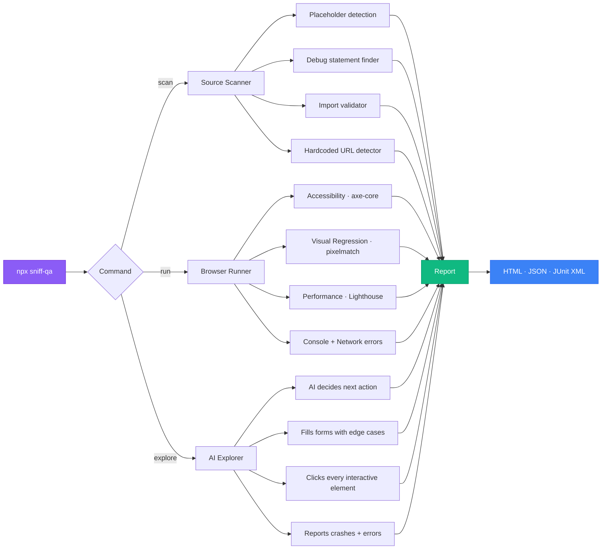

<div align="center">

<br />

```
     ███████╗███╗   ██╗██╗███████╗███████╗
     ██╔════╝████╗  ██║██║██╔════╝██╔════╝
     ███████╗██╔██╗ ██║██║█████╗  █████╗
     ╚════██║██║╚██╗██║██║██╔══╝  ██╔══╝
     ███████║██║ ╚████║██║██║     ██║
     ╚══════╝╚═╝  ╚═══╝╚═╝╚═╝     ╚═╝
```

**One command finds every bug in your app.**<br />
Accessibility. Visual regressions. Performance. Broken code. Security holes.

[](https://www.npmjs.com/package/sniff-qa)
[](LICENSE)
[](https://nodejs.org)
[](https://www.typescriptlang.org/)
[](https://playwright.dev)
[](https://github.com/adamboudj/sniff/actions/workflows/ci.yml)
[](CONTRIBUTING.md)

[Get Started](#-get-started) ·
[What It Finds](#-what-it-finds) ·
[How It Works](#-how-it-works) ·
[Commands](#-commands) ·
[CI Setup](#-ci-integration) ·
[MCP Server](#-mcp-server) ·
[Contributing](#-contributing)

</div>

---

## Why Sniff?

You write code. You ship it. Then users find the bugs you missed — broken contrast ratios, slow paint times, placeholder text left in production, forms that crash on emoji input.

**Sniff finds them first.**

No test files to write. No config to learn. One command scans your entire app across **5 dimensions** simultaneously:

| Dimension | What it catches | Powered by |
|-----------|----------------|------------|
| **Source** | TODOs, debug statements, broken imports, hardcoded URLs, placeholder text | Custom rule engine |
| **Accessibility** | WCAG violations, missing alt text, color contrast failures, keyboard traps | [axe-core](https://github.com/dequelabs/axe-core) |
| **Visual Regression** | Pixel-level UI changes between runs, layout shifts, broken styles | [pixelmatch](https://github.com/mapbox/pixelmatch) |
| **Performance** | Slow LCP, FCP, TTI — with budgets and severity thresholds | [Lighthouse](https://developer.chrome.com/docs/lighthouse) |
| **Exploration** | Crash-on-input bugs, XSS reflection, form edge cases, dead clicks | AI chaos monkey |

> [!TIP]
> Sniff works best as a pre-push check or CI gate. Run it before code review and catch the 80% of issues that are mechanical, not creative.

---

## Get Started

### One command, zero config

```bash
npx sniff-qa scan
```

That's it. Sniff scans your source code and reports every issue it finds.

### With browser testing

For the full suite (accessibility, visual regression, performance), point Sniff at a running app:

```bash
# Start your dev server first, then:
npx sniff-qa run --base-url http://localhost:3000
```

### Install locally

```bash
npm install -D sniff-qa
```

Then add to your `package.json`:

```json
{
  "scripts": {
    "qa": "sniff run --base-url http://localhost:3000",
    "qa:scan": "sniff scan",
    "qa:explore": "sniff explore --base-url http://localhost:3000"
  }
}
```

> [!NOTE]
> Sniff requires **Node.js 22+**. Playwright browsers are auto-installed on first run.

---

## What It Finds

### Source scanning (no browser needed)

```bash
npx sniff-qa scan
```

```
! HIGH (3)
  src/api/handler.ts:42    Debugger statement detected
  src/components/Hero.tsx:8 Lorem ipsum placeholder text detected
  src/utils/auth.ts:15     FIXME comment found

~ MEDIUM (12)
  src/app.ts:3              Hardcoded localhost URL detected
  src/lib/db.ts:7           TODO comment found
  ...

Found 15 issues: 3 high, 12 medium
```

**Rules include:** placeholder text (Lorem ipsum, TBD), debug statements (`debugger`, `console.log`), hardcoded URLs (`localhost`, `127.0.0.1`), broken relative imports, TODO/FIXME/HACK comments.

### Accessibility scanning

Powered by [axe-core](https://github.com/dequelabs/axe-core) through Playwright — the same engine used by Microsoft, Google, and the US government.

```
! CRITICAL
  /login  Missing form label — <input type="email"> has no associated label
  /login  Color contrast insufficient — ratio 2.1:1 (needs 4.5:1)

! HIGH
  /dashboard  Image missing alt text — 
  /settings   Keyboard trap — focus cannot leave modal
```

Every finding includes a **fix suggestion** with the exact contrast ratio needed or the WCAG rule violated.

### Visual regression

```bash
# First run captures baselines
npx sniff-qa run --base-url http://localhost:3000

# Subsequent runs diff against baselines
npx sniff-qa run --base-url http://localhost:3000
```

```
! HIGH
  /pricing  Visual difference: 2.3% pixels changed (threshold: 0.1%)
            Diff saved to: sniff-baselines/desktop/.diffs/_pricing.png
```

Baselines stored in `sniff-baselines/` — commit them to your repo to track visual changes across PRs.

### Performance budgets

Powered by [Lighthouse](https://developer.chrome.com/docs/lighthouse). Sniff measures Core Web Vitals and reports when you exceed budgets:

```
! HIGH
  /dashboard  LCP 4200ms exceeds budget of 2500ms (68% over)
              Tip: Defer non-critical resources, optimize largest image

~ MEDIUM
  /          FCP 2100ms exceeds budget of 1800ms (17% over)
```

Default budgets: LCP 2500ms, FCP 1800ms, TTI 3800ms. Override in config.

### Chaos monkey exploration

The AI-driven explorer autonomously navigates your app, fills forms with adversarial inputs (XSS payloads, SQL injection strings, Unicode edge cases, boundary values), and reports everything that breaks:

```bash
npx sniff-qa explore --base-url http://localhost:3000
```

```
  Steps completed: 47
  Pages visited: 12
  Findings: 3

! HIGH
  /signup  Console error after filling email with: <script>alert(1)</script>
           Uncaught TypeError: Cannot read property 'trim' of undefined
  /search  Network failure after filling query with: ' OR '1'='1
           POST /api/search returned 500
```

Every action is logged with the AI's reasoning in `.sniff/exploration-<timestamp>.json`.

---

## How It Works



**No test files. No selectors. No maintenance.** Sniff reads your codebase, discovers routes, and generates everything on the fly.

### Architecture

```
sniff-qa
├── Source Scanner ─── Regex rule engine over your codebase
├── Browser Runner ─── Playwright + page hook pipeline
│   ├── Accessibility ── axe-core injection + WCAG mapping
│   ├── Visual ──────── Screenshot capture + pixelmatch diffing
│   └── Performance ─── Chrome DevTools Protocol + Lighthouse
├── AI Explorer ─────── Claude-powered chaos monkey
├── Flakiness Engine ── History tracking + quarantine system
├── Report Generator ── HTML / JSON / JUnit XML output
└── MCP Server ──────── Model Context Protocol for AI IDEs
```

---

## Commands

### `sniff scan`

Static source analysis — no browser needed.

```bash
sniff scan                    # Scan with formatted output
sniff scan --json             # Machine-readable JSON
sniff scan --fail-on critical # Only fail on critical issues
```

### `sniff run`

Full browser-powered quality scan.

```bash
sniff run --base-url http://localhost:3000
sniff run --base-url http://localhost:3000 --format html,junit
sniff run --no-headless       # Watch the browser
sniff run --ci                # CI mode: headless + JUnit + flakiness tracking
sniff run --track-flakes      # Enable flakiness detection
```

### `sniff explore`

AI chaos monkey exploration.

```bash
sniff explore --base-url http://localhost:3000
sniff explore --base-url http://localhost:3000 --max-steps 100
sniff explore --no-headless   # Watch the AI navigate your app
sniff explore --json          # Structured output
```

### `sniff ci`

Generate a GitHub Actions workflow.

```bash
sniff ci                      # Creates .github/workflows/sniff.yml
sniff ci --force              # Overwrite existing
sniff ci --package-name my-qa # Custom package name
```

### `sniff report`

View results from the last run.

```bash
sniff report                  # Formatted terminal output
sniff report --format json    # JSON output
```

### `sniff init`

Generate a config file.

```bash
sniff init                    # Creates sniff.config.ts
```

---

## Configuration

Create a `sniff.config.ts` in your project root:

```typescript
import { defineConfig } from 'sniff-qa';

export default defineConfig({
  // Source scanner
  scanner: {
    include: ['src/**/*.{ts,tsx,js,jsx,vue,svelte}'],
    exclude: ['**/*.test.*', '**/node_modules/**'],
    rules: {
      'placeholder-lorem': 'high',
      'debug-console': 'medium',
    },
  },

  // Browser testing
  browser: {
    baseUrl: 'http://localhost:3000',
    headless: true,
    timeout: 30000,
  },

  // Viewports to test
  viewports: [
    { name: 'mobile', width: 375, height: 667 },
    { name: 'desktop', width: 1280, height: 720 },
  ],

  // Performance budgets
  performance: {
    budgets: {
      lcp: 2500,  // Largest Contentful Paint (ms)
      fcp: 1800,  // First Contentful Paint (ms)
      tti: 3800,  // Time to Interactive (ms)
    },
  },

  // Visual regression
  visual: {
    threshold: 0.1,  // % pixel difference to flag
    baselineDir: 'sniff-baselines',
  },

  // Flakiness detection
  flakiness: {
    windowSize: 5,   // Runs to consider
    threshold: 3,    // Failures to quarantine
  },

  // Chaos monkey
  exploration: {
    maxSteps: 50,
    timeout: 30000,
  },

  // Report output
  report: {
    formats: ['html', 'json'],
    outputDir: 'sniff-reports',
  },
});
```

> [!TIP]
> Start with zero config. Sniff has sensible defaults for everything. Add config only when you need to customize.

---

## CI Integration

### GitHub Actions (recommended)

Generate a workflow with one command:

```bash
npx sniff-qa ci
```

This creates `.github/workflows/sniff.yml` with:
- Playwright browser caching (fast CI runs)
- Automatic headless mode
- JUnit XML output for test reporters
- Flakiness detection + quarantine
- Report artifact upload (persists even on failure)

<details>
<summary>Generated workflow preview</summary>

```yaml
name: Sniff QA

on:
  push:
    branches: [main, master]
  pull_request:
    branches: [main, master]

jobs:
  sniff:
    runs-on: ubuntu-latest
    timeout-minutes: 15
    steps:
      - uses: actions/checkout@v4
      - uses: actions/setup-node@v4
        with:
          node-version: '22'
          cache: npm
      - run: npm ci

      # Cache Playwright browsers
      - uses: actions/cache@v4
        id: playwright-cache
        with:
          path: ~/.cache/ms-playwright
          key: ${{ runner.os }}-playwright-${{ hashFiles('package-lock.json') }}
      - if: steps.playwright-cache.outputs.cache-hit != 'true'
        run: npx playwright install --with-deps chromium
      - if: steps.playwright-cache.outputs.cache-hit == 'true'
        run: npx playwright install-deps chromium

      # Run Sniff
      - run: npx sniff-qa run --ci
        env:
          CI: true

      # Upload reports (even on failure)
      - uses: actions/upload-artifact@v4
        if: always()
        with:
          name: sniff-reports
          path: sniff-reports/
          retention-days: 30
```

</details>

### Flakiness quarantine

Sniff tracks test stability across runs. When a test fails intermittently (3 out of 5 runs by default), it's **quarantined** — it still runs, but won't block your CI pipeline:

```
  2 flaky test(s) quarantined (run but not blocking exit code)
```

History is stored in `.sniff/history.json`. Commit this file to share flakiness data across CI runs.

---

## MCP Server

Sniff includes an [MCP server](https://modelcontextprotocol.io) so AI coding assistants (Claude Code, Cursor, Windsurf) can run scans directly:

```bash
# Start the MCP server
sniff --mcp
```

### Available tools

| Tool | Description |
|------|-------------|
| `sniff_scan` | Run static source analysis |
| `sniff_run` | Run browser-based quality scan |
| `sniff_report` | Load and summarize last results |

### Claude Code plugin

Add Sniff to Claude Code:

```json
// .mcp.json in your project root
{
  "mcpServers": {
    "sniff": {
      "command": "npx",
      "args": ["sniff-qa", "--mcp"]
    }
  }
}
```

Then ask Claude: *"Run a sniff scan on this project"* or *"Check the accessibility of my app"*.

---

## Built With

Sniff stands on the shoulders of exceptional open-source projects:

| Project | Role in Sniff | License |
|---------|--------------|---------|
| [Playwright](https://playwright.dev) | Browser automation and testing | Apache-2.0 |
| [axe-core](https://github.com/dequelabs/axe-core) | Accessibility rule engine (WCAG 2.x) | MPL-2.0 |
| [Lighthouse](https://developer.chrome.com/docs/lighthouse) | Performance auditing (Core Web Vitals) | Apache-2.0 |
| [pixelmatch](https://github.com/mapbox/pixelmatch) | Pixel-level image comparison | ISC |
| [Commander.js](https://github.com/tj/commander.js) | CLI framework | MIT |
| [Zod](https://zod.dev) | Config schema validation | MIT |
| [MCP SDK](https://github.com/modelcontextprotocol/typescript-sdk) | AI tool protocol server | MIT |

---

## Comparison

| Feature | Sniff | Lighthouse CI | Pa11y | BackstopJS |
|---------|-------|--------------|-------|------------|
| Source scanning | Yes | No | No | No |
| Accessibility | Yes | Partial | Yes | No |
| Visual regression | Yes | No | No | Yes |
| Performance budgets | Yes | Yes | No | No |
| AI exploration | Yes | No | No | No |
| Flakiness detection | Yes | No | No | No |
| Zero config | Yes | No | No | No |
| Single command | Yes | No | No | No |
| MCP server | Yes | No | No | No |
| CI generator | Yes | Yes | No | No |

> [!NOTE]
> Sniff is not a replacement for a full test suite. It's the **automated QA layer** that catches what unit tests and E2E tests miss — the visual, accessibility, and performance issues that slip through because nobody writes tests for them.

---

## Roadmap

- [ ] **CSS specificity scanner** — detect specificity wars and `!important` abuse
- [ ] **SEO scanner** — meta tags, Open Graph, structured data validation
- [ ] **Bundle analyzer** — detect oversized dependencies and tree-shaking failures
- [ ] **Custom rule API** — write your own source rules as plugins
- [ ] **Baseline management UI** — visual tool for approving/rejecting visual changes
- [ ] **Slack/Discord notifications** — send scan results to your team
- [ ] **Monorepo support** — scan multiple packages with shared config
- [ ] **Watch mode** — re-scan on file changes during development

See the [open issues](https://github.com/adamboudj/sniff/issues) for community-requested features.

---

## Contributing

Contributions are what make open source incredible. Whether it's a bug fix, a new scanner rule, or documentation improvements — **every contribution matters**.

See [CONTRIBUTING.md](CONTRIBUTING.md) for setup instructions and guidelines.

### Good first issues

Look for issues labeled [`good first issue`](https://github.com/adamboudj/sniff/labels/good%20first%20issue) — these are scoped, well-documented tasks perfect for first-time contributors.

The easiest way to contribute? **Add a source rule.** Each rule is a single regex pattern with a severity level. See `src/scanners/source/rules/` for examples.

---

## License

[Apache License 2.0](LICENSE) — open source, free to use, modify, and distribute. Contributions welcome. Attribution required in derivative works (see [NOTICE](NOTICE)).

---

<div align="center">

**Made by [Adam Boudj](https://github.com/adamboudj)**

If Sniff saved you from shipping a bug, [give it a star](https://github.com/adamboudj/sniff). It helps others find it.

</div>
