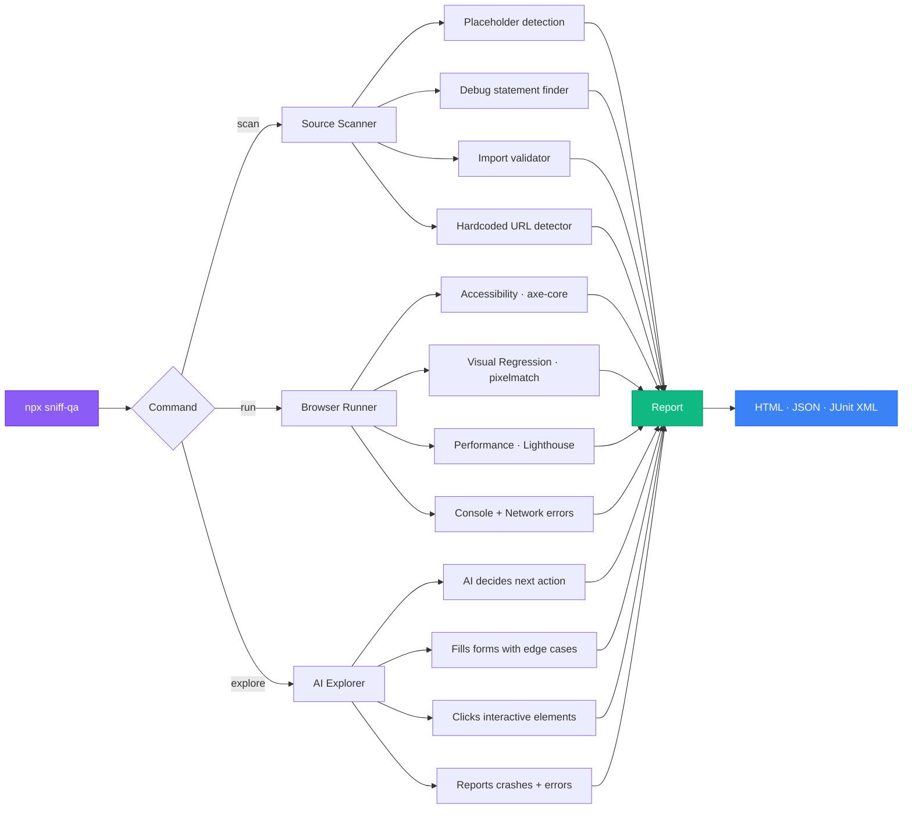

<div align="center">

<br />

<pre>
                  ╱|、        
                (˚ˎ 。7       
                 |、˜〵        
                 じしˍ,)ノ      

        ┌─────────────────────────┐
        │   s n i f f             │
        │   ─────────             │
        │   finds bugs before     │
        │   your users do.        │
        └─────────────────────────┘
</pre>

<h3>Autonomous QA for people who'd rather ship than write tests.</h3>

<p>
One command. Five scanning dimensions. Zero config.<br />
Source bugs, accessibility gaps, visual regressions, slow pages, and crash-on-input forms — caught before they hit production.
</p>

<br />

[](https://www.npmjs.com/package/sniff-qa)
[](LICENSE)
[](https://nodejs.org)
[](https://www.typescriptlang.org/)
[](https://playwright.dev)
[](https://github.com/Aboudjem/sniff/actions/workflows/ci.yml)
[](CONTRIBUTING.md)

<br />

[Quickstart](#quickstart) · [What It Catches](#what-it-catches) · [All Commands](#all-commands) · [Under the Hood](#under-the-hood) · [CI Setup](#ci-integration) · [MCP Server](#mcp-server) · [Contributing](#contributing)

</div>

<br />

---

<br />

## The problem

You ship a feature. Looks great locally. Then a user on a 4G connection waits 6 seconds for your dashboard to paint. Someone using a screen reader can't get past your login form. And your landing page still says "Lorem ipsum" in the footer because nobody caught it in review.

These aren't edge cases. They're the bugs that ship every single day because nobody writes tests for them.

**Sniff handles the grunt work.** It reads your codebase, spins up real browsers, and scans across five dimensions at once — so you can focus on building features instead of chasing down contrast ratios.

<br />

| What gets checked | What it catches | Under the hood |
|:---|:---|:---|
| **Source code** | Leftover TODOs, `debugger` statements, broken imports, hardcoded URLs, placeholder text | Custom regex rule engine |
| **Accessibility** | WCAG violations, missing labels, insufficient contrast, keyboard traps | [axe-core](https://github.com/dequelabs/axe-core) via Playwright |
| **Visual regression** | Pixel-level UI drift between runs, layout shifts, broken styles | [pixelmatch](https://github.com/mapbox/pixelmatch) |
| **Performance** | Slow LCP, FCP, TTI — flagged when they blow past your budgets | [Lighthouse](https://developer.chrome.com/docs/lighthouse) |
| **Exploration** | Crash-on-input bugs, XSS reflection, forms that break on emoji or SQL injection | AI-driven chaos monkey |

<br />

> [!TIP]
> Sniff works well as a pre-push hook or CI gate. It catches the mechanical stuff — the 80% of bugs that shouldn't need a human to spot them.

<br />

---

<br />

## Quickstart

Run Sniff against any project in under a minute. Pick what fits your situation:

### 1. Scan source code (fastest — no browser needed)

```bash
npx sniff-qa scan
```

Checks for placeholder text, debug leftovers, broken imports, hardcoded URLs. Done in seconds.

### 2. Full quality sweep (browser-powered)

Start your dev server, then point Sniff at it:

```bash
npx sniff-qa run --base-url http://localhost:3000
```

Runs accessibility, visual regression, performance, console error, and network failure checks — all in one pass.

### 3. Let the AI explore your app

The chaos monkey clicks everything, fills every form with nasty inputs, and reports what breaks:

```bash
npx sniff-qa explore --base-url http://localhost:3000
```

### 4. Set up CI in one step

```bash
npx sniff-qa ci
```

Generates a `.github/workflows/sniff.yml` with Playwright caching, JUnit output, and flakiness tracking.

### 5. Add to your project permanently

```bash
npm install -D sniff-qa
```

```json
{
  "scripts": {
    "qa": "sniff run --base-url http://localhost:3000",
    "qa:scan": "sniff scan",
    "qa:explore": "sniff explore --base-url http://localhost:3000"
  }
}
```

> [!NOTE]
> Requires **Node.js 22+**. Playwright browsers auto-install on first browser command.

<br />

---

<br />

## What it catches

### Source code issues — no browser required

```bash
npx sniff-qa scan
```

```
! HIGH (3)
  src/api/handler.ts:42    Debugger statement detected
  src/components/Hero.tsx:8 Lorem ipsum placeholder text detected
  src/utils/auth.ts:15     FIXME comment found

~ MEDIUM (12)
  src/app.ts:3              Hardcoded localhost URL detected
  src/lib/db.ts:7           TODO comment found
  ...

Found 15 issues: 3 high, 12 medium
```

Catches the stuff that slips through code review: placeholder copy, debug leftovers, hardcoded URLs that'll break in production, imports pointing at files that don't exist. Fast enough to run on every save.

### Accessibility violations

Built on [axe-core](https://github.com/dequelabs/axe-core) — the same engine behind the accessibility audits at Microsoft, Google, and across US government sites.

```
! CRITICAL
  /login  Missing form label — <input type="email"> has no associated label
  /login  Color contrast insufficient — ratio 2.1:1 (needs 4.5:1)

! HIGH
  /dashboard  Image missing alt text — 
  /settings   Keyboard trap — focus cannot leave modal
```

Each finding tells you exactly what's wrong and how to fix it. Not just "contrast is bad" — you get the actual ratio and the target you need to hit.

### Visual regressions

```bash
# First run saves baseline screenshots
npx sniff-qa run --base-url http://localhost:3000

# Every run after that diffs against the baselines
npx sniff-qa run --base-url http://localhost:3000
```

```
! HIGH
  /pricing  Visual difference: 2.3% pixels changed (threshold: 0.1%)
            Diff saved to: sniff-baselines/desktop/.diffs/_pricing.png
```

No Percy subscription. No Applitools contract. Just local pixel diffing with [pixelmatch](https://github.com/mapbox/pixelmatch). Commit the baselines to your repo and you've got visual regression tracking across every PR.

### Performance budgets

Uses [Lighthouse](https://developer.chrome.com/docs/lighthouse) under the hood to measure the metrics that actually matter to users:

```
! HIGH
  /dashboard  LCP 4200ms exceeds budget of 2500ms (68% over)
              Tip: Defer non-critical resources, optimize largest image

~ MEDIUM
  /          FCP 2100ms exceeds budget of 1800ms (17% over)
```

Default budgets: LCP 2500ms, FCP 1800ms, TTI 3800ms. Tweak them in your config if your app has different expectations.

### Chaos monkey exploration

This one's different. Instead of checking pages you tell it about, the AI explorer roams your app on its own — clicking buttons, filling forms with nasty inputs (XSS payloads, SQL injection, Unicode edge cases, absurdly long strings), and reporting whatever breaks.

```bash
npx sniff-qa explore --base-url http://localhost:3000
```

```
  Steps completed: 47
  Pages visited: 12
  Findings: 3

! HIGH
  /signup  Console error after filling email with: <script>alert(1)</script>
           Uncaught TypeError: Cannot read property 'trim' of undefined
  /search  Network failure after filling query with: ' OR '1'='1
           POST /api/search returned 500
```

Every action gets logged with the AI's reasoning — why it clicked that button, why it chose that payload. Full trace saved to `.sniff/exploration-<timestamp>.json`.

<br />

---

<br />

## Under the hood



No test files to write. No selectors to maintain. Sniff reads your code, discovers your routes, and generates everything at runtime.

<br />

<details>
<summary><strong>Architecture overview</strong></summary>

<br />

```
sniff-qa
├── Source Scanner ─── Regex rule engine across your codebase
├── Browser Runner ─── Playwright + page hook pipeline
│   ├── Accessibility ── axe-core injection + WCAG mapping
│   ├── Visual ──────── Screenshot capture + pixelmatch diffing
│   └── Performance ─── Chrome DevTools Protocol + Lighthouse
├── AI Explorer ─────── Claude-powered chaos monkey
├── Flakiness Engine ── Run history tracking + quarantine logic
├── Report Generator ── HTML / JSON / JUnit XML output
└── MCP Server ──────── Model Context Protocol for AI-powered editors
```

The scanner system is pluggable — each dimension implements a common interface, so adding a new scanner doesn't touch core code. The AI layer uses a provider abstraction: Claude Code CLI by default (no API key needed), with Anthropic API as a drop-in alternative for CI.

</details>

<br />

---

<br />

## All commands

Everything Sniff can do, at a glance.

| Command | What it does | Needs browser? |
|:---|:---|:---:|
| `sniff scan` | Source code analysis (TODOs, debug, broken imports) | No |
| `sniff run` | Full quality sweep (a11y, visual, perf, console, network) | Yes |
| `sniff explore` | AI chaos monkey — clicks everything, fills forms with edge cases | Yes |
| `sniff ci` | Generates a GitHub Actions workflow | No |
| `sniff report` | Shows results from the last run | No |
| `sniff init` | Scaffolds a config file | No |

<details>
<summary><strong>sniff scan</strong> — source code analysis</summary>

```bash
sniff scan                    # Formatted terminal output
sniff scan --json             # Machine-readable JSON
sniff scan --fail-on critical # Only block on critical severity
```

</details>

<details>
<summary><strong>sniff run</strong> — full browser-powered sweep</summary>

```bash
sniff run --base-url http://localhost:3000
sniff run --base-url http://localhost:3000 --format html,junit
sniff run --no-headless       # Watch the browser do its thing
sniff run --ci                # CI mode: headless + JUnit + flakiness tracking
sniff run --track-flakes      # Turn on flakiness detection
```

</details>

<details>
<summary><strong>sniff explore</strong> — AI chaos monkey</summary>

```bash
sniff explore --base-url http://localhost:3000
sniff explore --base-url http://localhost:3000 --max-steps 100
sniff explore --no-headless   # Watch the AI navigate your app
sniff explore --json          # Structured output
```

</details>

<details>
<summary><strong>sniff ci</strong> — generate CI workflow</summary>

```bash
sniff ci                      # Creates .github/workflows/sniff.yml
sniff ci --force              # Overwrite an existing one
sniff ci --package-name my-qa # Use a different package name in the workflow
```

</details>

<details>
<summary><strong>sniff report</strong> / <strong>sniff init</strong></summary>

```bash
sniff report                  # Formatted terminal output from last run
sniff report --format json    # JSON output

sniff init                    # Creates sniff.config.ts with defaults
```

</details>

<br />

---

<br />

## Configuration

You don't need a config file to get started — Sniff picks smart defaults. But when you want control, drop a `sniff.config.ts` in your project root:

```typescript
import { defineConfig } from 'sniff-qa';

export default defineConfig({
  // What to scan
  scanner: {
    include: ['src/**/*.{ts,tsx,js,jsx,vue,svelte}'],
    exclude: ['**/*.test.*', '**/node_modules/**'],
    rules: {
      'placeholder-lorem': 'high',
      'debug-console': 'medium',
    },
  },

  // Browser settings
  browser: {
    baseUrl: 'http://localhost:3000',
    headless: true,
    timeout: 30000,
  },

  // Responsive testing
  viewports: [
    { name: 'mobile', width: 375, height: 667 },
    { name: 'desktop', width: 1280, height: 720 },
  ],

  // When is a page "too slow"?
  performance: {
    budgets: {
      lcp: 2500,  // Largest Contentful Paint (ms)
      fcp: 1800,  // First Contentful Paint (ms)
      tti: 3800,  // Time to Interactive (ms)
    },
  },

  // How much pixel drift is acceptable?
  visual: {
    threshold: 0.1,
    baselineDir: 'sniff-baselines',
  },

  // When to quarantine flaky tests
  flakiness: {
    windowSize: 5,   // Look at the last N runs
    threshold: 3,    // Quarantine after N failures
  },

  // How deep should the explorer dig?
  exploration: {
    maxSteps: 50,
    timeout: 30000,
  },

  // What format do you want results in?
  report: {
    formats: ['html', 'json'],
    outputDir: 'sniff-reports',
  },
});
```

> [!TIP]
> Most people never touch this file. The defaults cover the common case. Add config when you actually need to override something — not before.

<br />

---

<br />

## CI integration

### GitHub Actions

One command gets you a production-grade workflow:

```bash
npx sniff-qa ci
```

That drops a `.github/workflows/sniff.yml` in your repo with Playwright browser caching, headless mode, JUnit output for test reporters, flakiness tracking, and report artifacts that survive failed runs.

<details>
<summary><strong>See the generated workflow</strong></summary>

```yaml
name: Sniff QA

on:
  push:
    branches: [main, master]
  pull_request:
    branches: [main, master]

jobs:
  sniff:
    runs-on: ubuntu-latest
    timeout-minutes: 15
    steps:
      - uses: actions/checkout@v4
      - uses: actions/setup-node@v4
        with:
          node-version: '22'
          cache: npm
      - run: npm ci

      - uses: actions/cache@v4
        id: playwright-cache
        with:
          path: ~/.cache/ms-playwright
          key: ${{ runner.os }}-playwright-${{ hashFiles('package-lock.json') }}
      - if: steps.playwright-cache.outputs.cache-hit != 'true'
        run: npx playwright install --with-deps chromium
      - if: steps.playwright-cache.outputs.cache-hit == 'true'
        run: npx playwright install-deps chromium

      - run: npx sniff-qa run --ci
        env:
          CI: true

      - uses: actions/upload-artifact@v4
        if: always()
        with:
          name: sniff-reports
          path: sniff-reports/
          retention-days: 30
```

</details>

### Dealing with flaky tests

Nobody likes a test that passes on Monday and fails on Tuesday. Sniff tracks each test's pass/fail history in `.sniff/history.json`. When something fails 3 out of 5 recent runs, it gets **quarantined** — still runs, still shows up in reports, but won't tank your CI pipeline.

```
  2 flaky test(s) quarantined (run but not blocking exit code)
```

Commit the history file to share flakiness data across your team's CI runs.

<br />

---

<br />

## MCP server

Sniff ships with an [MCP server](https://modelcontextprotocol.io) so AI-powered editors like Claude Code, Cursor, and Windsurf can trigger scans without you leaving your editor.

```bash
sniff --mcp
```

| Tool | What it does |
|:---|:---|
| `sniff_scan` | Runs static source analysis and returns structured findings |
| `sniff_run` | Launches browser-based quality scan against a live URL |
| `sniff_report` | Pulls up results from the most recent scan |

### Wire it up in Claude Code

Drop this in a `.mcp.json` at your project root:

```json
{
  "mcpServers": {
    "sniff": {
      "command": "npx",
      "args": ["sniff-qa", "--mcp"]
    }
  }
}
```

Then just ask Claude: *"Scan this project for issues"* or *"Check the accessibility on localhost:3000"*.

<br />

---

<br />

## Standing on solid ground

Sniff doesn't reinvent the wheel. It wires together proven, battle-tested open-source tools and adds the orchestration layer that was missing.

| Project | What it does here | License |
|:---|:---|:---|
| [Playwright](https://playwright.dev) | Drives real browsers — Chromium, WebKit, Firefox | Apache-2.0 |
| [axe-core](https://github.com/dequelabs/axe-core) | The industry-standard accessibility rule engine | MPL-2.0 |
| [Lighthouse](https://developer.chrome.com/docs/lighthouse) | Performance auditing with Core Web Vitals | Apache-2.0 |
| [pixelmatch](https://github.com/mapbox/pixelmatch) | Pixel-level screenshot comparison | ISC |
| [Commander.js](https://github.com/tj/commander.js) | CLI argument parsing and help generation | MIT |
| [Zod](https://zod.dev) | Runtime schema validation for configs and AI output | MIT |
| [MCP SDK](https://github.com/modelcontextprotocol/typescript-sdk) | Model Context Protocol server implementation | MIT |

<br />

---

<br />

## How it stacks up

There are great tools that do one of these things well. Sniff does all of them in a single pass.

|  | Sniff | Lighthouse CI | Pa11y | BackstopJS |
|:---|:---:|:---:|:---:|:---:|
| Source code scanning | **Yes** | — | — | — |
| Accessibility | **Yes** | Partial | **Yes** | — |
| Visual regression | **Yes** | — | — | **Yes** |
| Performance budgets | **Yes** | **Yes** | — | — |
| AI exploration | **Yes** | — | — | — |
| Flakiness detection | **Yes** | — | — | — |
| Works with zero config | **Yes** | — | — | — |
| Single command | **Yes** | — | — | — |
| MCP server for AI editors | **Yes** | — | — | — |
| CI workflow generator | **Yes** | **Yes** | — | — |

> [!NOTE]
> Sniff isn't a replacement for your test suite. Think of it as the automated QA layer that catches what humans tend to miss — the contrast ratios, the leftover debug code, the pages that render fine but take forever to load. The stuff nobody writes tests for.

<br />

---

<br />

## What's next

Stuff we're working on or thinking about. No promises on timelines, but these are the directions that make sense.

- [ ] **CSS specificity scanner** — catch specificity wars and `!important` creep
- [ ] **SEO checker** — meta tags, Open Graph, structured data
- [ ] **Bundle analyzer** — oversized dependencies, tree-shaking gaps
- [ ] **Custom rule API** — bring your own source scanning rules
- [ ] **Baseline management UI** — approve or reject visual changes visually
- [ ] **Slack / Discord alerts** — pipe scan results to your team chat
- [ ] **Monorepo support** — scan multiple packages with shared config
- [ ] **Watch mode** — re-scan automatically as you edit

Got an idea? [Open an issue](https://github.com/Aboudjem/sniff/issues). We read everything.

<br />

---

<br />

## Contributing

The easiest contribution? **Add a source rule.** Each rule is a regex pattern with a severity level — look at `src/scanners/source/rules/` to see how simple they are. Beyond that, bug fixes, new scanners, and doc improvements are all welcome.

Check [CONTRIBUTING.md](CONTRIBUTING.md) for the full setup guide. Issues labeled [`good first issue`](https://github.com/Aboudjem/sniff/labels/good%20first%20issue) are a great starting point if you're new here.

<br />

---

<br />

## License

[Apache 2.0](LICENSE) — free to use, fork, and build on.

<br />

---

<div align="center">

<br />

Built by [**Adam Boudj**](https://github.com/Aboudjem)

Found a bug Sniff missed? [Open an issue.](https://github.com/Aboudjem/sniff/issues) Sniff found a bug your tests missed? [Drop a star.](https://github.com/Aboudjem/sniff)

<br />

</div>
