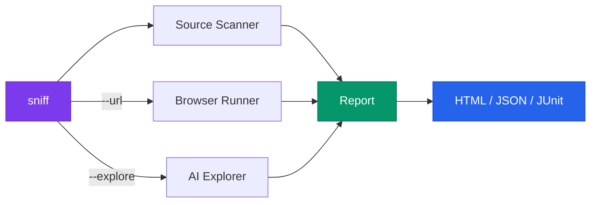

<div align="center">

<br />

<picture>
  <source media="(prefers-color-scheme: dark)" srcset="https://raw.githubusercontent.com/Aboudjem/sniff/main/.github/assets/logo-dark.svg">
  <source media="(prefers-color-scheme: light)" srcset="https://raw.githubusercontent.com/Aboudjem/sniff/main/.github/assets/logo-light.svg">
  
</picture>

<pre>
        ╱|、
      (˚ˎ 。7
       |、˜〵
       じしˍ,)ノ

      <b>s n i f f</b>
</pre>

### One command. Five checks. Zero config.

Source bugs · Accessibility · Visual regression · Performance · AI exploration

<br />

[](https://www.npmjs.com/package/sniff-qa)
[](LICENSE)
[](https://nodejs.org)
[](https://www.typescriptlang.org/)
[](https://playwright.dev)
[](https://github.com/Aboudjem/sniff/actions/workflows/ci.yml)

</div>

<br />

## What is this

Sniff scans your app across five dimensions in a single command. No test files to write, no config to set up.

```
npx sniff-qa
```

It checks your **source code** for leftover debug statements and placeholder text, your **UI** for accessibility violations, your **screenshots** for visual regressions, your **page speed** against performance budgets, and optionally lets an **AI explorer** fill your forms with XSS payloads and Unicode edge cases to see what breaks.

> [!TIP]
> Works great as a pre-push check, a CI gate, or an MCP tool inside Claude Code / Cursor / Windsurf.

<br />

## Quickstart

```bash
# Source scan only (no browser needed)
npx sniff-qa

# Full quality sweep against a running app
npx sniff-qa --url http://localhost:3000

# Include AI chaos monkey exploration
npx sniff-qa --url http://localhost:3000 --explore

# CI mode (headless, JUnit XML, flakiness tracking)
npx sniff-qa --url http://localhost:3000 --ci

# Generate a GitHub Actions workflow
npx sniff-qa ci
```

> [!NOTE]
> Requires **Node.js 22+**. Browser dependencies install automatically on first run.

<br />

## What it finds

### Source code

Runs without a browser. Catches things code review misses.

```
! HIGH (3)
  src/api/handler.ts:42    Debugger statement detected
  src/components/Hero.tsx:8 Lorem ipsum placeholder text
  src/utils/auth.ts:15     FIXME comment found

~ MEDIUM (12)
  src/app.ts:3              Hardcoded localhost URL
  src/lib/db.ts:7           TODO comment found
```

**Checks for:** placeholder text, `debugger` / `console.log`, hardcoded URLs, broken imports, TODO/FIXME/HACK comments.

### Accessibility

Built on [axe-core](https://github.com/dequelabs/axe-core), the same engine used at Microsoft, Google, and across US government sites.

```
! CRITICAL
  /login  Missing form label on <input type="email">
  /login  Color contrast 2.1:1 (needs 4.5:1)

! HIGH
  /dashboard  Image missing alt text
  /settings   Keyboard trap in modal
```

Every finding comes with the exact fix: the ratio you need, the WCAG rule, the element selector.

### Visual regression

```
! HIGH
  /pricing  2.3% pixels changed (threshold: 0.1%)
            Diff: sniff-baselines/desktop/.diffs/_pricing.png
```

Local pixel diffing with [pixelmatch](https://github.com/mapbox/pixelmatch). No Percy subscription, no cloud dependency. Commit the baselines to track changes across PRs.

### Performance

[Lighthouse](https://developer.chrome.com/docs/lighthouse) audits with budget enforcement:

```
! HIGH
  /dashboard  LCP 4200ms (budget: 2500ms, 68% over)

~ MEDIUM
  /          FCP 2100ms (budget: 1800ms, 17% over)
```

Defaults: LCP 2500ms, FCP 1800ms, TTI 3800ms. Override in config.

### AI exploration

The chaos monkey navigates your app autonomously: clicking buttons, filling forms with adversarial inputs, reporting crashes.

```
! HIGH
  /signup  Console error filling email with: <script>alert(1)</script>
           TypeError: Cannot read property 'trim' of undefined
  /search  POST /api/search returned 500
           Input: ' OR '1'='1
```

Every action is traced with reasoning in `.sniff/exploration-<timestamp>.json`.

<br />

## How it works



```
sniff
 ├─ Source Scanner ···· regex rules across your codebase
 ├─ Browser Runner ···· Playwright + axe-core + pixelmatch + Lighthouse
 ├─ AI Explorer ······· Claude-powered chaos monkey
 ├─ Flakiness Engine ·· run history + quarantine
 ├─ Report Generator ·· HTML / JSON / JUnit XML
 └─ MCP Server ········ tools for AI-powered editors
```

<br />

## CLI reference

### Main command

| Usage | What happens |
|:--|:--|
| `sniff` | Source scan only |
| `sniff --url <url>` | Source + browser (a11y, visual, perf) |
| `sniff --url <url> --explore` | Source + browser + AI chaos monkey |
| `sniff --ci` | CI mode: headless, JUnit, flakiness tracking |

### Flags

| Flag | What it does |
|:--|:--|
| `--url <url>` | Target URL for browser testing |
| `--explore` | Run AI chaos monkey exploration |
| `--max-steps <n>` | Exploration step limit (default: 50) |
| `--ci` | Headless + JUnit XML + flakiness tracking |
| `--json` | Machine-readable JSON output |
| `--format html,json,junit` | Choose report formats |
| `--fail-on <severities>` | Exit non-zero on these levels (default: critical,high) |
| `--track-flakes` | Enable flakiness detection |
| `--no-headless` | Show the browser window |
| `--source-only` | Skip browser even if URL is configured |

### Utility commands

| Command | What it does |
|:--|:--|
| `sniff ci` | Generate GitHub Actions workflow |
| `sniff init` | Scaffold a config file |
| `sniff report` | View last scan results |
| `sniff update-baselines` | Accept current screenshots as baselines |

<br />

## Configuration

Optional. Sniff picks smart defaults. Drop a `sniff.config.ts` when you want control:

```typescript
import { defineConfig } from 'sniff-qa';

export default defineConfig({
  scanner: {
    include: ['src/**/*.{ts,tsx,js,jsx,vue,svelte}'],
    exclude: ['**/*.test.*'],
  },
  browser: {
    baseUrl: 'http://localhost:3000',
    timeout: 30000,
  },
  viewports: [
    { name: 'mobile', width: 375, height: 667 },
    { name: 'desktop', width: 1280, height: 720 },
  ],
  performance: {
    budgets: { lcp: 2500, fcp: 1800, tti: 3800 },
  },
  visual: { threshold: 0.1 },
  flakiness: { windowSize: 5, threshold: 3 },
  exploration: { maxSteps: 50 },
  report: { formats: ['html', 'json'] },
});
```

<br />

## CI integration

```bash
npx sniff-qa ci
```

Generates `.github/workflows/sniff.yml` with Playwright caching, headless mode, JUnit output, flakiness quarantine, and report artifacts.

<details>
<summary>Generated workflow</summary>

```yaml
name: Sniff QA
on:
  push:
    branches: [main, master]
  pull_request:
    branches: [main, master]
jobs:
  sniff:
    runs-on: ubuntu-latest
    timeout-minutes: 15
    steps:
      - uses: actions/checkout@v4
      - uses: actions/setup-node@v4
        with:
          node-version: '22'
          cache: npm
      - run: npm ci
      - uses: actions/cache@v4
        id: pw
        with:
          path: ~/.cache/ms-playwright
          key: ${{ runner.os }}-pw-${{ hashFiles('package-lock.json') }}
      - if: steps.pw.outputs.cache-hit != 'true'
        run: npx playwright install --with-deps chromium
      - if: steps.pw.outputs.cache-hit == 'true'
        run: npx playwright install-deps chromium
      - run: npx sniff-qa --ci
        env:
          CI: true
      - uses: actions/upload-artifact@v4
        if: always()
        with:
          name: sniff-reports
          path: sniff-reports/
          retention-days: 30
```

</details>

**Flakiness quarantine:** tests that fail 3/5 recent runs get quarantined. They still run, still show in reports, but won't block your pipeline. History lives in `.sniff/history.json`.

<br />

## MCP server

For AI-powered editors (Claude Code, Cursor, Windsurf). Add to `.mcp.json`:

```json
{
  "mcpServers": {
    "sniff": {
      "command": "npx",
      "args": ["sniff-qa", "--mcp"]
    }
  }
}
```

**Tools exposed:** `sniff_scan` (source analysis), `sniff_run` (browser scan), `sniff_report` (last results).

Then ask your AI: *"Scan this project for issues"* or *"Check accessibility on localhost:3000"*.

<br />

## Built on

| | Project | Role | License |
|:--|:--|:--|:--|
| 🎭 | [Playwright](https://playwright.dev) | Browser automation | Apache-2.0 |
| ♿ | [axe-core](https://github.com/dequelabs/axe-core) | Accessibility engine (WCAG 2.x) | MPL-2.0 |
| 🔦 | [Lighthouse](https://developer.chrome.com/docs/lighthouse) | Performance auditing | Apache-2.0 |
| 🔲 | [pixelmatch](https://github.com/mapbox/pixelmatch) | Screenshot comparison | ISC |
| 📐 | [Zod](https://zod.dev) | Schema validation | MIT |
| 🔌 | [MCP SDK](https://github.com/modelcontextprotocol/typescript-sdk) | AI tool protocol | MIT |

<br />

## Comparison

|  | Sniff | Lighthouse CI | Pa11y | BackstopJS |
|:--|:--:|:--:|:--:|:--:|
| Source scanning | **Yes** | | | |
| Accessibility | **Yes** | Partial | **Yes** | |
| Visual regression | **Yes** | | | **Yes** |
| Performance | **Yes** | **Yes** | | |
| AI exploration | **Yes** | | | |
| Flakiness detection | **Yes** | | | |
| Zero config | **Yes** | | | |
| Single command | **Yes** | | | |
| MCP server | **Yes** | | | |

<br />

## Contributing

Easiest way in: **add a source rule.** Each rule is a regex + severity level in `src/scanners/source/rules/`. See [CONTRIBUTING.md](CONTRIBUTING.md) for the full guide.

Issues labeled [`good first issue`](https://github.com/Aboudjem/sniff/labels/good%20first%20issue) are scoped for newcomers.

<br />

## License

[Apache 2.0](LICENSE)

---

<div align="center">

Built by [**Adam Boudj**](https://github.com/Aboudjem)

Found a bug Sniff missed? [Open an issue.](https://github.com/Aboudjem/sniff/issues)
Sniff found one your tests didn't? [Drop a star.](https://github.com/Aboudjem/sniff)

</div>
