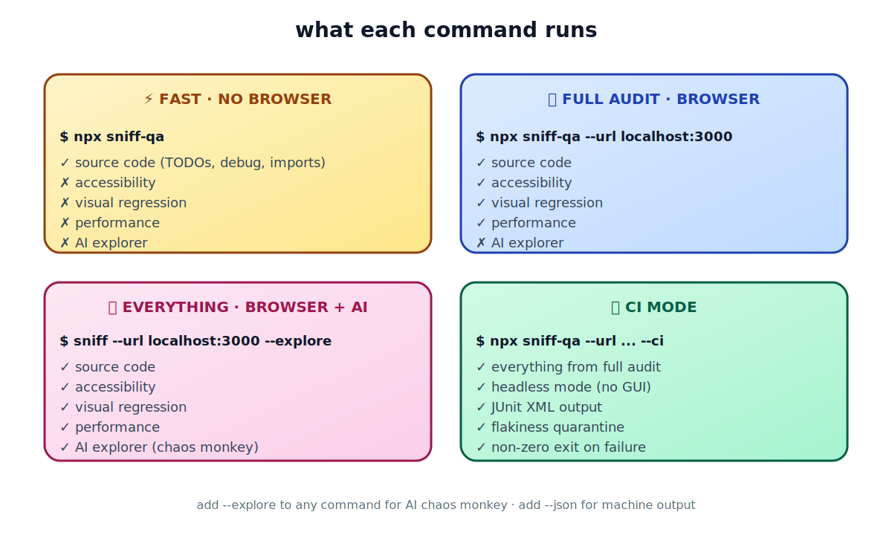

<div align="center">

<br />

<pre>
        ╱|、
      (˚ˎ 。7
       |、˜〵
       じしˍ,)ノ

      <b>s n i f f</b>
</pre>

### One command. Five checks. Zero config.

Catch source bugs, accessibility violations, visual regressions, slow pages, and crash-on-input forms before your users do.

<br />

[](https://www.npmjs.com/package/sniff-qa)
[](LICENSE)
[](https://nodejs.org)
[](https://www.typescriptlang.org/)
[](https://playwright.dev)
[](https://github.com/Aboudjem/sniff/actions/workflows/ci.yml)

</div>

<br />

## What is this

Sniff is a single-command QA tool. Point it at a project and it scans across five dimensions in parallel:

<div align="center">


</div>

No test files. No config. No API keys. Works locally, works in CI, works as an MCP server inside Claude Code, Cursor, or Windsurf.

<br />

## Quickstart

```bash
npx sniff-qa
```

That's it. You'll see results in a few seconds. Want the full audit? Add a URL.

```bash
npx sniff-qa --url http://localhost:3000
```

<br />

## Pick your scan

<div align="center">



</div>

| You want to... | Run |
|:--|:--|
| **Quick source scan** (no browser) | `npx sniff-qa` |
| **Full quality audit** (browser) | `npx sniff-qa --url http://localhost:3000` |
| **Everything + AI explorer** | `npx sniff-qa --url http://localhost:3000 --explore` |
| **Run in CI** (headless, JUnit) | `npx sniff-qa --url http://localhost:3000 --ci` |
| **Generate a CI workflow** | `npx sniff-qa ci` |

> [!NOTE]
> Requires Node.js 22+. Playwright browsers install automatically the first time you run a browser scan.

<br />

## What gets checked

<table>
<tr>
<td width="50%" valign="top">

### 📄 Source code

```
! HIGH (3)
  src/api/handler.ts:42    Debugger statement
  src/components/Hero.tsx:8 Lorem ipsum text
  src/utils/auth.ts:15     FIXME comment

~ MEDIUM (12)
  src/app.ts:3   Hardcoded localhost URL
  src/lib/db.ts:7 TODO comment
```

Catches the stuff code review misses: leftover `debugger`, placeholder text, hardcoded URLs, broken relative imports, TODO/FIXME tags.

</td>
<td width="50%" valign="top">

### ♿ Accessibility

```
! CRITICAL
  /login  Missing form label
  /login  Color contrast 2.1:1 (needs 4.5:1)

! HIGH
  /dashboard  Image missing alt text
  /settings   Keyboard trap in modal
```

Powered by [axe-core](https://github.com/dequelabs/axe-core), the same engine used by Microsoft, Google, and US government sites. Every finding includes the fix.

</td>
</tr>
<tr>
<td width="50%" valign="top">

### 🖼 Visual regression

```
! HIGH
  /pricing  2.3% pixels changed
            (threshold: 0.1%)
  Diff saved: sniff-baselines/.../diff.png
```

Local pixel diffing with [pixelmatch](https://github.com/mapbox/pixelmatch). No Percy subscription, no cloud dependency. Commit baselines to track changes across PRs.

</td>
<td width="50%" valign="top">

### ⚡ Performance

```
! HIGH
  /dashboard  LCP 4200ms
              budget 2500ms (68% over)

~ MEDIUM
  /  FCP 2100ms
     budget 1800ms (17% over)
```

[Lighthouse](https://developer.chrome.com/docs/lighthouse) audits with budget enforcement. Default budgets: LCP 2500ms, FCP 1800ms, TTI 3800ms.

</td>
</tr>
<tr>
<td colspan="2" valign="top">

### 🤖 AI chaos monkey (`--explore`)

```
! HIGH
  /signup  Console error filling email with: <script>alert(1)</script>
           TypeError: Cannot read property 'trim' of undefined
  /search  POST /api/search returned 500
           Input: ' OR '1'='1
```

Roams your app autonomously. Clicks buttons, fills forms with adversarial inputs (XSS, SQL injection, Unicode edge cases), reports crashes. Every action traced with reasoning in `.sniff/exploration-<timestamp>.json`.

</td>
</tr>
</table>

<br />

## All commands

### Main command

```bash
sniff [target] [options]
```

| Flag | Effect |
|:--|:--|
| `--url <url>` | Enable browser tests against this URL |
| `--explore` | Add AI chaos monkey exploration (requires `--url`) |
| `--max-steps <n>` | Cap exploration steps (default: 50) |
| `--ci` | CI mode: headless, JUnit XML, flakiness tracking |
| `--json` | JSON output for machine consumption |
| `--format <list>` | Report formats: `html`, `json`, `junit` (comma-separated) |
| `--fail-on <list>` | Severities that exit non-zero (default: `critical,high`) |
| `--track-flakes` | Enable flakiness detection across runs |
| `--no-headless` | Show the browser window |
| `--source-only` | Skip browser even if URL is configured |

### Utility commands

| Command | Purpose |
|:--|:--|
| `sniff init` | Scaffold a `sniff.config.ts` file |
| `sniff ci` | Generate `.github/workflows/sniff.yml` |
| `sniff report` | View results from the last run |
| `sniff update-baselines` | Accept current screenshots as new baselines |

<br />

## Configuration

Optional. Sniff has sensible defaults. Drop `sniff.config.ts` in your project root when you want control:

```typescript
import { defineConfig } from 'sniff-qa';

export default defineConfig({
  scanner: {
    include: ['src/**/*.{ts,tsx,js,jsx,vue,svelte}'],
    exclude: ['**/*.test.*'],
  },
  browser: {
    baseUrl: 'http://localhost:3000',
    timeout: 30000,
  },
  viewports: [
    { name: 'mobile', width: 375, height: 667 },
    { name: 'desktop', width: 1280, height: 720 },
  ],
  performance: {
    budgets: { lcp: 2500, fcp: 1800, tti: 3800 },
  },
  visual: { threshold: 0.1 },
  flakiness: { windowSize: 5, threshold: 3 },
  exploration: { maxSteps: 50 },
  report: { formats: ['html', 'json'] },
});
```

<br />

## CI integration

```bash
npx sniff-qa ci
```

Generates a complete GitHub Actions workflow with Playwright browser caching, headless mode, JUnit output, flakiness quarantine, and report artifacts that survive failed runs.

<details>
<summary><b>See the generated workflow</b></summary>

```yaml
name: Sniff QA
on:
  push:
    branches: [main, master]
  pull_request:
    branches: [main, master]
jobs:
  sniff:
    runs-on: ubuntu-latest
    timeout-minutes: 15
    steps:
      - uses: actions/checkout@v4
      - uses: actions/setup-node@v4
        with:
          node-version: '22'
          cache: npm
      - run: npm ci
      - uses: actions/cache@v4
        id: pw
        with:
          path: ~/.cache/ms-playwright
          key: ${{ runner.os }}-pw-${{ hashFiles('package-lock.json') }}
      - if: steps.pw.outputs.cache-hit != 'true'
        run: npx playwright install --with-deps chromium
      - if: steps.pw.outputs.cache-hit == 'true'
        run: npx playwright install-deps chromium
      - run: npx sniff-qa --ci
        env:
          CI: true
      - uses: actions/upload-artifact@v4
        if: always()
        with:
          name: sniff-reports
          path: sniff-reports/
          retention-days: 30
```

</details>

**Flakiness quarantine.** Tests that fail 3 of 5 recent runs get quarantined. They still run, still appear in reports, but won't block your pipeline. History lives in `.sniff/history.json`.

<br />

## Use it inside Claude Code, Cursor, or Windsurf

Sniff ships with an MCP server. Add this to your project's `.mcp.json`:

```json
{
  "mcpServers": {
    "sniff": {
      "command": "npx",
      "args": ["sniff-qa", "--mcp"]
    }
  }
}
```

Then ask your AI: *"Scan this project for issues"* or *"Check accessibility on localhost:3000"*.

**Tools exposed:**

| Tool | What it does |
|:--|:--|
| `sniff_scan` | Static source analysis |
| `sniff_run` | Browser-based quality scan |
| `sniff_report` | Last scan results |

<br />

## Built on

| | Project | Role | License |
|:--|:--|:--|:--|
| 🎭 | [Playwright](https://playwright.dev) | Browser automation | Apache-2.0 |
| ♿ | [axe-core](https://github.com/dequelabs/axe-core) | Accessibility engine | MPL-2.0 |
| 🔦 | [Lighthouse](https://developer.chrome.com/docs/lighthouse) | Performance auditing | Apache-2.0 |
| 🔲 | [pixelmatch](https://github.com/mapbox/pixelmatch) | Screenshot comparison | ISC |
| 📐 | [Zod](https://zod.dev) | Schema validation | MIT |
| 🔌 | [MCP SDK](https://github.com/modelcontextprotocol/typescript-sdk) | AI tool protocol | MIT |

<br />

## Compared to

|  | **Sniff** | Lighthouse CI | Pa11y | BackstopJS |
|:--|:--:|:--:|:--:|:--:|
| Source scanning | ✅ | | | |
| Accessibility | ✅ | partial | ✅ | |
| Visual regression | ✅ | | | ✅ |
| Performance budgets | ✅ | ✅ | | |
| AI exploration | ✅ | | | |
| Flakiness detection | ✅ | | | |
| Zero config | ✅ | | | |
| Single command | ✅ | | | |
| MCP server | ✅ | | | |

<br />

## Contributing

Easiest way in: **add a source rule.** Each rule is a regex pattern with a severity level. See `src/scanners/source/rules/` for examples and read [CONTRIBUTING.md](CONTRIBUTING.md) for the full setup.

Issues labeled [`good first issue`](https://github.com/Aboudjem/sniff/labels/good%20first%20issue) are scoped for newcomers.

<br />

## License

[Apache 2.0](LICENSE)

---

<div align="center">

Built by [**Adam Boudj**](https://github.com/Aboudjem)

Found a bug Sniff missed? [Open an issue.](https://github.com/Aboudjem/sniff/issues)
Sniff found one your tests didn't? [Drop a star.](https://github.com/Aboudjem/sniff)

</div>
