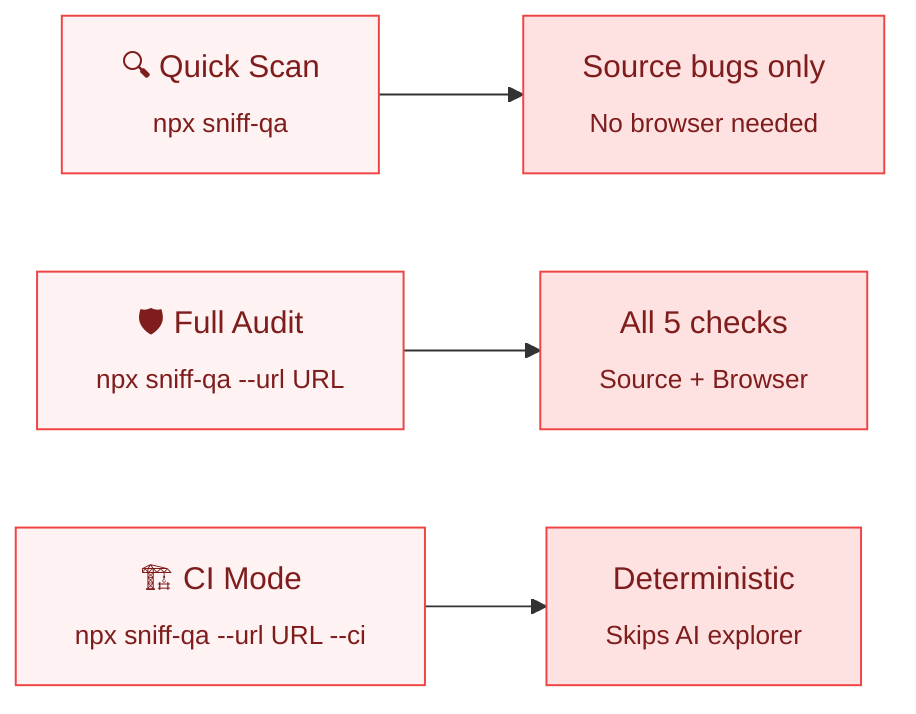
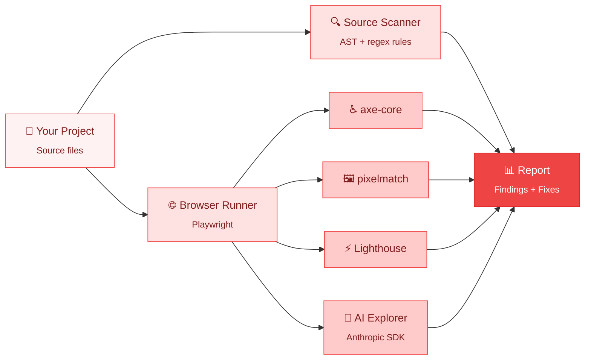

<picture>
  <source media="(prefers-color-scheme: dark)" srcset=".github/assets/logo-dark.svg">
  <source media="(prefers-color-scheme: light)" srcset=".github/assets/logo-light.svg">
  
</picture>

<p align="center">
  <a href="https://www.npmjs.com/package/sniff-qa"></a>
  <a href="LICENSE"></a>
  <a href="https://github.com/Aboudjem/sniff/actions/workflows/ci.yml"></a>
  <a href="https://nodejs.org"></a>
  <a href="https://github.com/Aboudjem/sniff/stargazers"></a>
</p>

<p align="center">
  <b>One command. Five checks. Zero config.</b><br/>
  <sub>Source bugs, accessibility, visual regression, performance, and AI exploration. All in one pass.</sub>
</p>

---

<br/>

## What is this?

You ship features. But did you actually *test* them?

**sniff** is an AI-powered QA tool that scans your project for real problems: leftover debugger statements, accessibility violations, visual regressions, performance budget breaches, and even adversarial edge cases. It does all five in a single command.

```bash
npx sniff-qa
```

That's it. No config files. No signup. No API keys. It just works.

<br/>

## Quick start

| Step | Action |
|:----:|:-------|
| **1** | Run a source scan: `npx sniff-qa` |
| **2** | Run the full audit: `npx sniff-qa --url http://localhost:3000` |
| **3** | Read the report and fix what matters |

The source scan finishes in seconds. The full audit adds accessibility, visual regression, performance, and AI exploration on top of it.

> [!TIP]
> Drop your URL in `sniff.config.ts` once and you can just run `sniff` for the full audit every time.

<br/>

## The three modes



```bash
npx sniff-qa                                   # quick scan (no browser)
npx sniff-qa --url http://localhost:3000       # full audit (everything)
npx sniff-qa --url http://localhost:3000 --ci  # ci mode (skips AI explorer)
```

CI mode auto-skips the AI explorer because it is non-deterministic. Everything else runs exactly the same.

<br/>

## What it checks

<table>
<tr>
<td width="50%" valign="top">

**📄 Source code**

```
! HIGH (3)
  src/api/handler.ts:42    Debugger statement
  src/components/Hero.tsx:8 Lorem ipsum text
  src/utils/auth.ts:15     FIXME comment
```

Leftover `debugger`, placeholder text, hardcoded URLs, broken imports, TODO/FIXME tags.

</td>
<td width="50%" valign="top">

**♿ Accessibility** ([axe-core](https://github.com/dequelabs/axe-core))

```
! CRITICAL
  /login  Missing form label
  /login  Color contrast 2.1:1 (needs 4.5:1)
```

WCAG 2.x violations with exact fix guidance.

</td>
</tr>
<tr>
<td valign="top">

**🖼 Visual regression** ([pixelmatch](https://github.com/mapbox/pixelmatch))

```
! HIGH
  /pricing  2.3% pixels changed
            (threshold: 0.1%)
```

Local pixel diffing. Commit baselines to track UI changes across PRs.

</td>
<td valign="top">

**⚡ Performance** ([Lighthouse](https://developer.chrome.com/docs/lighthouse))

```
! HIGH
  /dashboard  LCP 4200ms
              budget 2500ms (68% over)
```

Defaults: LCP 2500ms, FCP 1800ms, TTI 3800ms.

</td>
</tr>
<tr>
<td colspan="2" valign="top">

**🤖 AI explorer**

```
! HIGH
  /signup  Console error filling email with: <script>alert(1)</script>
           TypeError: Cannot read property 'trim' of undefined
```

Roams your app, fills forms with adversarial inputs (XSS, SQL injection, Unicode), reports crashes. Action trace saved to `.sniff/exploration-<timestamp>.json`.

</td>
</tr>
</table>

<br/>

## How it works



Your code goes in. A report with actionable findings comes out. Sniff auto-detects your framework and runs the right checks. You don't configure anything.

<br/>

## Compared to

| | **Sniff** | Lighthouse CI | Pa11y | BackstopJS |
|:--|:--:|:--:|:--:|:--:|
| Source scanning | ✅ | ❌ | ❌ | ❌ |
| Accessibility | ✅ | partial | ✅ | ❌ |
| Visual regression | ✅ | ❌ | ❌ | ✅ |
| Performance | ✅ | ✅ | ❌ | ❌ |
| AI exploration | ✅ | ❌ | ❌ | ❌ |
| Flakiness quarantine | ✅ | ❌ | ❌ | ❌ |
| Single command | ✅ | ❌ | ❌ | ❌ |
| MCP server | ✅ | ❌ | ❌ | ❌ |
| Zero config | ✅ | ❌ | ❌ | ❌ |

> [!IMPORTANT]
> Sniff is the **first QA tool with native MCP integration**. Your AI editor can trigger scans, read results, and fix issues without you switching context.

<br/>

## Works with your stack

No config needed. Sniff auto-detects your framework from `package.json` and source files.

<table>
<tr>
<td align="center" width="16%"><b>⚛️ React</b></td>
<td align="center" width="16%"><b>▲ Next.js</b></td>
<td align="center" width="16%"><b>💚 Vue</b></td>
<td align="center" width="16%"><b>🔶 Svelte</b></td>
<td align="center" width="16%"><b>🅰️ Angular</b></td>
<td align="center" width="16%"><b>🌐 Vanilla</b></td>
</tr>
<tr>
<td align="center">JSX / TSX</td>
<td align="center">App Router</td>
<td align="center">SFC</td>
<td align="center">Components</td>
<td align="center">Templates</td>
<td align="center">HTML / CSS</td>
</tr>
</table>

<br/>

## 🔌 Use with your AI editor

Sniff ships an MCP server. Pick your tool and copy the snippet.

<details>
<summary><b>Claude Code</b></summary>

```bash
claude mcp add sniff-qa npx sniff-qa --mcp
```

Or `.mcp.json`:

```json
{
  "mcpServers": {
    "sniff-qa": { "command": "npx", "args": ["sniff-qa", "--mcp"] }
  }
}
```

</details>

<details>
<summary><b>Cursor</b></summary>

`~/.cursor/mcp.json` or `.cursor/mcp.json`:

```json
{
  "mcpServers": {
    "sniff-qa": {
      "type": "stdio",
      "command": "npx",
      "args": ["sniff-qa", "--mcp"]
    }
  }
}
```

</details>

<details>
<summary><b>Windsurf</b></summary>

`~/.codeium/windsurf/mcp_config.json`:

```json
{
  "mcpServers": {
    "sniff-qa": { "command": "npx", "args": ["sniff-qa", "--mcp"] }
  }
}
```

</details>

<details>
<summary><b>Codex CLI</b></summary>

```bash
codex mcp add sniff-qa --command "npx sniff-qa --mcp"
```

</details>

<details>
<summary><b>Gemini CLI</b></summary>

`~/.gemini/mcp_config.json`:

```json
{
  "mcpServers": {
    "sniff-qa": { "command": "npx", "args": ["sniff-qa", "--mcp"] }
  }
}
```

</details>

<details>
<summary><b>Continue.dev</b></summary>

`.continue/mcpServers/sniff-qa.yaml`:

```yaml
mcpServers:
  sniff-qa:
    command: npx
    args: [sniff-qa, --mcp]
    type: stdio
```

</details>

Once configured, ask: *"Scan this project for issues"* or *"Check accessibility on localhost:3000"*.

**MCP tools exposed:** `sniff_scan` (source), `sniff_run` (browser), `sniff_report` (last results).

<br/>

## Install

```bash
npm install -D sniff-qa
```

```json
{
  "scripts": {
    "qa": "sniff --url http://localhost:3000"
  }
}
```

Then run `npm run qa`. Requires Node.js 22+. Playwright browsers install automatically the first time.

<br/>

## 🏗️ CI integration

```bash
npx sniff-qa ci
```

Generates `.github/workflows/sniff.yml` with Playwright caching, JUnit output, flakiness quarantine, and report artifacts.

**Flakiness quarantine.** Tests that fail 3 of 5 runs get quarantined. They still run, still appear in reports, but won't block your pipeline.

<br/>

## All commands

<details>
<summary><b>📋 Full CLI reference</b></summary>
<br/>

```
sniff                       quick scan (source only)
sniff --url <url>           full audit (everything)
sniff --url <url> --ci      ci mode (no AI explorer)

sniff init                  scaffold sniff.config.ts
sniff ci                    generate .github/workflows/sniff.yml
sniff report                show last results
sniff update-baselines      accept current screenshots as baselines
```

### Flags (all optional)

| Flag | Effect |
|:--|:--|
| `--no-explore` | Skip AI explorer in full mode |
| `--no-browser` | Force source-only even when URL is set |
| `--max-steps <n>` | Cap exploration steps (default: 50) |
| `--no-headless` | Show the browser window |
| `--format html,json,junit` | Choose report formats |
| `--fail-on critical,high` | Severities that exit non-zero |
| `--track-flakes` | Enable flakiness detection |
| `--json` | Machine-readable output |

</details>

<br/>

## Configuration

<details>
<summary><b>⚙️ sniff.config.ts reference</b></summary>
<br/>

Optional. Drop `sniff.config.ts` in your project root:

```typescript
import { defineConfig } from 'sniff-qa';

export default defineConfig({
  browser: {
    baseUrl: 'http://localhost:3000',
  },
  viewports: [
    { name: 'mobile', width: 375, height: 667 },
    { name: 'desktop', width: 1280, height: 720 },
  ],
  performance: {
    budgets: { lcp: 2500, fcp: 1800, tti: 3800 },
  },
  visual: { threshold: 0.1 },
  exploration: { maxSteps: 50 },
  flakiness: { windowSize: 5, threshold: 3 },
});
```

</details>

<br/>

## 🔒 Trust and privacy

| | |
|:--|:--|
| 🚫 | **No telemetry.** Sniff does not phone home. Ever. |
| 🔑 | **No signup.** No accounts. No API keys for core functionality. |
| 📦 | **No data collection.** Your code stays on your machine. |
| 👁️ | **Open source.** Read every line. Apache 2.0. |

> [!NOTE]
> The AI explorer requires an Anthropic API key only if you want the chaos monkey feature. The other four checks (source, accessibility, visual regression, performance) work completely offline with zero external calls.

<br/>

## Built on

[Playwright](https://playwright.dev) · [axe-core](https://github.com/dequelabs/axe-core) · [Lighthouse](https://developer.chrome.com/docs/lighthouse) · [pixelmatch](https://github.com/mapbox/pixelmatch) · [Zod](https://zod.dev) · [MCP SDK](https://github.com/modelcontextprotocol/typescript-sdk) · [Anthropic SDK](https://github.com/anthropics/anthropic-sdk-node)

<br/>

## Contributing

Easiest way in: **add a source rule.** Each rule is a regex pattern with a severity level in `src/scanners/source/rules/`. See [CONTRIBUTING.md](CONTRIBUTING.md).

**Good first contributions:**
- 🔧 Add a new source scanning rule
- 🐛 Report a false positive
- 📚 Improve documentation

<br/>

## License

[Apache 2.0](LICENSE)

---

<p align="center">
  <a href="https://www.linkedin.com/in/adam-boudjemaa/"></a>
  <a href="https://x.com/AdamBoudj"></a>
  <a href="https://adam-boudjemaa.com/"></a>
</p>

<p align="center">
  <sub>Built by <a href="https://github.com/Aboudjem">Adam Boudjemaa</a> · Apache 2.0 · No telemetry · No data collection</sub>
</p>
