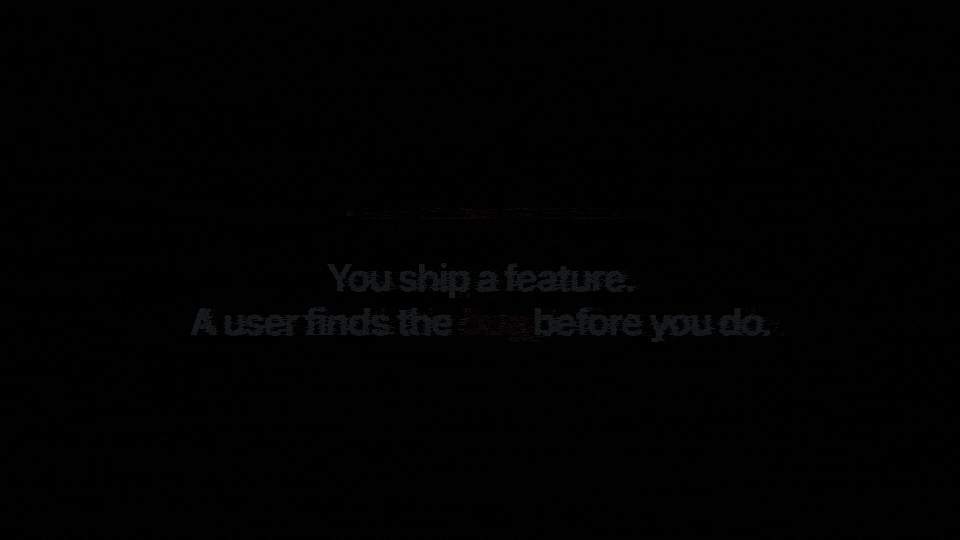

<picture>
  <source media="(prefers-color-scheme: dark)" srcset="https://raw.githubusercontent.com/Aboudjem/sniff/main/.github/assets/logo-dark.svg">
  <source media="(prefers-color-scheme: light)" srcset="https://raw.githubusercontent.com/Aboudjem/sniff/main/.github/assets/logo-light.svg">
  
</picture>

<p align="center">
  <a href="https://www.npmjs.com/package/sniff-qa"></a>
  <a href="https://www.npmjs.com/package/sniff-qa"></a>
  <a href="../LICENSE"></a>
  <a href="https://github.com/Aboudjem/sniff/actions/workflows/ci.yml"></a>
  <a href="https://nodejs.org"></a>
  <a href="https://github.com/Aboudjem/10x"></a>
  <a href="https://github.com/Aboudjem/sniff/stargazers"></a>
</p>

<p align="center">
  <a href="../README.md">English</a> ·
  <a href="zh-CN.md">简体中文</a> ·
  <a href="ja.md">日本語</a> ·
  <b>Español</b> ·
  <a href="fr.md">Français</a>
</p>

<p align="center"><b>Apúntalo hacia tu aplicación en ejecución. Recorre tus flujos de usuario reales en un navegador real y te dice qué está realmente roto, con pruebas.</b></p>

<p align="center">
  <a href="#empezar">Empezar</a> ·
  <a href="#qué-encuentra">Qué encuentra</a> ·
  <a href="#por-qué-puedes-fiarte">Por qué fiarte</a> ·
  <a href="#cómo-funciona">Cómo funciona</a> ·
  <a href="#demo">Demo</a> ·
  <a href="#faq">FAQ</a>
</p>



<picture>
  <source media="(prefers-color-scheme: dark)" srcset="https://raw.githubusercontent.com/Aboudjem/sniff/main/.github/assets/sniff-diagram.svg">
   recorrido en navegador sin cabeza -> hallazgos con pruebas" src="https://raw.githubusercontent.com/Aboudjem/sniff/main/.github/assets/sniff-diagram.svg" width="100%">
</picture>

---

## ¿Qué es esto?

Sniff es un escáner de QA autónomo. Lo apuntas hacia una aplicación web en ejecución y **recorre los flujos de usuario reales de tu app en un navegador real (sin cabeza)** (haciendo clic en botones, rellenando formularios, siguiendo enlaces) y reporta qué está realmente roto.

**No** es un linter y **no** es un escáner estático. Abre tus páginas, interactúa con ellas como lo haría un usuario, y observa qué sucede.

Cada error que reporta viene con **prueba**: la página exacta, los pasos ordenados para reproducirlo, una captura de pantalla y el fragmento de consola o red que lo captó. Un hallazgo sin prueba de reproducción no es un hallazgo.

```bash
npx sniff-qa --url http://localhost:3000
```

Un solo comando, sin configuración, sin clave de API, sin instalación de Playwright. Apúntalo hacia tu aplicación en ejecución, o simplemente ejecuta `npx sniff-qa` desde tu proyecto y detecta automáticamente un servidor de desarrollo en los puertos habituales.

> Sniff recorre una **aplicación en ejecución**. Si no hay ningún servidor de desarrollo activo, recurre a un análisis del código fuente y te indica exactamente cómo iniciar el recorrido real. Consulta [Empezar](#empezar).

---

## Empezar

Necesitas **Node.js 22+** y una aplicación web que puedas ejecutar localmente (o una URL).

> **Nomenclatura:** el paquete npm es **`sniff-qa`**, así que usa `npx sniff-qa` o `npm install -D sniff-qa`. Una vez instalado, el binario es **`sniff`** (el binario `sniff-qa` también funciona). No ejecutes `npx sniff`, ese es un paquete diferente.

### 1. Inicia tu aplicación

```bash
npm run dev        # o como sea que arranques tu app
```

### 2. Recórrela

En otra terminal:

```bash
npx sniff-qa --url http://localhost:3000     # apúntalo hacia tu app en ejecución
```

Esa es la línea de comandos más fiable. Sniff también **detecta automáticamente** un servidor de desarrollo en los puertos habituales, así que desde la carpeta de tu proyecto a menudo puedes ejecutar simplemente `npx sniff-qa` sin ningún argumento. Si tu app está en un puerto no estándar (o la detección automática falla), pasa `--url` (eso siempre funciona). También recorre una URL desplegada:

```bash
npx sniff-qa --url https://staging.myapp.com
```

> **¿Encontró errores? Sale con código distinto de cero, a propósito.** Un recorrido que encuentra problemas sale con el código `1` para que el CI falle la compilación; **no** es un fallo (verás una línea `✓ Scan complete`). Pasa `--fail-on none` para que siempre salga con `0`.

> **El primer arranque descarga un navegador.** La primera vez que Sniff abre un navegador, descarga una compilación de Chromium (~165 MB, una sola vez). Verás el progreso. Necesitas acceso a internet para esa primera ejecución; después queda en caché.

### 3. Lee el informe

Los hallazgos se imprimen en tu terminal, agrupados por gravedad, cada uno con los pasos para reproducirlo. ¿Quieres una página que puedas compartir?

```bash
npx sniff-qa --url http://localhost:3000 --report   # ejecuta un recorrido y escribe sniff-reports/sniff-report.html (autocontenido)
```

**¿Sin aplicación en ejecución?** Sniff no falla en silencio. Ejecuta un análisis solo del código fuente e imprime un siguiente paso claro (inicia tu servidor de desarrollo o pasa `--url`) para que puedas llegar al recorrido real. También puedes ejecutar el análisis del código fuente a propósito:

```bash
npx sniff-qa scan         # análisis solo del código fuente, sin navegador
```

¿Atascado? Ejecuta `npx sniff-qa doctor` para verificar tu entorno (Node, navegador, servidor de desarrollo).

---

## Qué encuentra

Sniff recorre tu aplicación y busca **12 clases de errores reales**:

| # | Clase | Ejemplos |
|:--|:------|:---------|
| 1 | **Páginas / rutas rotas** | Respuestas 4xx/5xx, renders en blanco, pantallas de fallo |
| 2 | **Enlaces rotos** | Enlaces internos y externos muertos |
| 3 | **Errores de consola y red** | Excepciones no capturadas y peticiones fallidas *durante la interacción* |
| 4 | **Datos vacíos y falsos** | Datos faltantes, más marcadores de posición como `lorem ipsum`, `TODO`, `test@test.com` |
| 5 | **Formularios rotos** | Botones de envío inactivos, validación que nunca se dispara |
| 6 | **Pérdida de estado** | Rellena un formulario, pulsa atrás y se borra |
| 7 | **Regresiones de flujo / callejones sin salida** | Un recorrido que no puede completarse |
| 8 | **Estados de carga y error defectuosos** | Spinners infinitos, estados de error ausentes |
| 9 | **Resultados asíncronos rotos** | Enviado pero sin confirmación de éxito (marcado como "necesita verificación fuera de banda") |
| 10 | **Problemas de diseño responsivo** | Desbordamiento y objetivos táctiles demasiado pequeños (pase móvil a 375px) |
| 11 | **Accesibilidad** | Texto alternativo y etiquetas ausentes, contraste, vía [axe-core](https://github.com/dequelabs/axe-core) |
| 12 | **Acciones primarias poco claras** | La llamada a la acción principal está enterrada o es ambigua |

Cada hallazgo incluye:

- **Prueba de reproducción**: la ruta exacta, los pasos ordenados, una captura de pantalla y el fragmento de consola/red.
- **Una gravedad**, para que corrijas lo más importante primero.
- **Una confianza**: `confirmed` (confirmado), `likely` (probable) o `uncertain` (incierto). Los hallazgos inciertos están ocultos por defecto; añade `--all` para verlos.
- **Una corrección sugerida.**

<picture>
  <source media="(prefers-color-scheme: dark)" srcset="https://raw.githubusercontent.com/Aboudjem/sniff/main/.github/assets/features-dark.svg">
  <source media="(prefers-color-scheme: light)" srcset="https://raw.githubusercontent.com/Aboudjem/sniff/main/.github/assets/features-light.svg">
  
</picture>

---

## Por qué puedes fiarte

La mayoría de los escáneres te inundan de falsos positivos hasta que dejas de leerlos. Sniff está construido a la inversa.

Lo medimos en una aplicación de prueba sembrada con **21 errores en las 12 clases**, más una página de control limpia que debería producir cero hallazgos:

| | Motor antiguo | Motor nuevo |
|:--|:--|:--|
| Errores encontrados | 9 / 21 (43%) | **21 / 21 (100%)** |
| Precisión | ~13% | **100%** |
| Falsos positivos | 125 | **0** |
| Hallazgos en la página limpia | n/a | **0** |
| Comando principal | falló | funciona |

Esas cifras están bloqueadas como test de regresión. El conjunto completo es **441 tests**.

**Cómo mantiene los falsos positivos cerca de cero:**

- Un **filtro de ruido** propio elimina la basura que no es tu error: favicons, analíticas, chatter de hot-module-reload, redirecciones de autenticación esperadas, abortos del motor.
- Los hallazgos de accesibilidad están respaldados por **axe-core**, que es de cero falsos positivos por diseño.
- **Los hallazgos inciertos se suprimen por defecto** (usa `--all` para verlos).
- Una página rota se reporta **una vez**, no se vuelve a marcar en cada enlace que apunta a ella.

Si Sniff no puede probar un error, no lo reclama.

---

## ¿En qué se diferencia?

Los linters leen tu código fuente. Los frameworks end-to-end requieren que *tú* escribas los tests. Los verificadores de enlaces solo comprueban enlaces. Sniff maneja tu aplicación real y juzga el resultado.

| | **Sniff** | linkinator | pa11y | Playwright codegen | Servicios estilo QA-Wolf |
|:--|:--|:--|:--|:--|:--|
| Recorre flujos de usuario reales en un navegador | **Sí** | No | No | Tú lo escribes | Sí |
| Sin configuración, sin escritura de tests | **Sí** | Sí | Sí | No (tú escribes los tests) | No (incorporación) |
| Enlaces rotos | **Sí** | Sí | No | Manual | Manual |
| Accesibilidad (axe-core) | **Sí** | No | **Sí** | Manual | Algunos |
| Datos vacíos / marcadores de posición / falsos | **Sí** | No | No | No | No |
| Pérdida de estado (el botón atrás borra un formulario) | **Sí** | No | No | Manual | Manual |
| Prueba de reproducción única por hallazgo | **Sí** | No | Parcial | No | Varía |
| Informe HTML autocontenido | **Sí** | No | Parcial | No | Panel |
| Se ejecuta localmente, sin cuenta, sin clave de API | **Sí** | Sí | Sí | Sí | No (servicio) |

Lo que Sniff hace de forma única en un solo comando: capturar **datos vacíos/marcadores de posición**, **pérdida de estado** y **resultados asíncronos rotos**, y entregarte un único informe de prueba, **sin scripts que escribir y sin ningún servicio en el que registrarse**.

---

## Comandos

```
sniff                  Recorre tu app (detecta el servidor de desarrollo automáticamente). El predeterminado.
sniff --url <url>      Recorre una URL específica
sniff scan             Análisis solo del código fuente, sin navegador (marcadores de posición, TODOs, enlaces muertos, etc.)
sniff report           Muestra los resultados de la última ejecución
sniff doctor           Verifica tu entorno (Node, navegador, configuración, servidor de desarrollo)
sniff ci               Genera un flujo de trabajo de GitHub Actions
sniff fix              Corrige automáticamente los problemas seguros (console.log, debugger, etc.)
sniff --help           Muestra todos los comandos y argumentos
sniff --version        Muestra la versión
```

### Argumentos útiles

| Argumento | Qué hace |
|:-----|:-------------|
| `--url <url>` | Recorre esta URL en lugar de detectar automáticamente |
| `--report` | Escribe un informe HTML autocontenido en `sniff-reports/sniff-report.html` |
| `--all` | También muestra los hallazgos de baja confianza (`uncertain`) |
| `--max-pages <n>` | Limita cuántas páginas recorrer (predeterminado: 25) |
| `--no-mobile` | Omite el pase responsivo a 375px |
| `--headed` | Muestra la ventana del navegador mientras recorre |
| `--json` | Salida JSON legible por máquina |
| `--ci` | Modo CI (salida estable, no interactivo) |
| `--fail-on <sev>` | Sale con código distinto de cero en hallazgos de esta gravedad o superior |

---

## Demo

Una ejecución real contra una aplicación con errores: 21 problemas reales, cero falsos positivos, cada hallazgo con gravedad, confianza, pasos de reproducción y una corrección. Observa cómo Sniff recorre la app y transmite los hallazgos en tiempo real (la demo animada se reproduce al principio de este README, [`.github/assets/demo.gif`](../.github/assets/demo.gif)).

A continuación se muestra la misma ejecución como imagen de terminal estilizada:


---

## Úsalo desde tu editor de IA

Sniff también viene como servidor MCP. Añádelo una vez y luego simplemente pide a tu asistente *"escanea este proyecto en busca de errores"* o *"recorre mi app."* Si tu app está en ejecución, Sniff la detecta automáticamente, así que no tienes que pasar una URL.

**Una herramienta unificada `sniff`, tres modos:**

- `walk`: **recomendado.** Recorre los flujos reales de tu app en ejecución (el recorrido de flujo descrito arriba).
- `scan`: análisis solo del código fuente, sin navegador.
- `report`: muestra los resultados de la última ejecución.

(`run` y `discover` son modos heredados mantenidos por compatibilidad retroactiva.)

### Comandos slash y herramientas MCP

Como plugin de Claude Code, Sniff añade tres comandos slash:

| Comando slash | Qué hace |
|:--------------|:-------------|
| `/sniff` | Recorre tu app en ejecución y encuentra errores reales (el recorrido de flujo). |
| `/sniff-fix` | Escanea y corrige automáticamente los problemas seguros (`console.log` sueltos, `debugger`, etc.). |
| `/sniff-report` | Muestra los resultados de la última ejecución. |

Como servidor MCP, la superficie es **una herramienta unificada `sniff`** que acepta `{ mode, rootDir, baseUrl? }`. Los tres modos anteriores (`walk` / `scan` / `report`) son la forma de manejarlo, y la herramienta unificada es la que debes usar. Las herramientas individuales de propósito único (`sniff_scan`, `sniff_run`, `sniff_report`, más `sniff_discover` y `sniff_install`) permanecen registradas por compatibilidad retroactiva y capacidades acotadas, pero el trabajo nuevo debe ir a través de la herramienta unificada `sniff`.

### Instala las habilidades en cualquier CLI de IA

El servidor MCP anterior funciona en cualquier cliente compatible con MCP. Para cargar también las habilidades `/sniff` directamente en otro CLI, ejecuta el instalador de una línea. Crea enlaces simbólicos de las tres habilidades en el directorio de habilidades de ese CLI; `--update` descarga la última versión y vuelve a enlazar, `--uninstall` las elimina.

```bash
curl -fsSL https://raw.githubusercontent.com/Aboudjem/sniff/main/install.sh | bash -s codex
```

En Windows, ejecuta `install.ps1 <platform>` desde una copia del repositorio (se necesita el Modo de Desarrollador o un shell elevado para los enlaces simbólicos).

| Plataforma | Directorio de habilidades | Línea de instalación |
|:--|:--|:--|
| Claude Code | (plugin) | `claude plugin install sniff@10x` |
| Codex / Gemini / OpenCode / Pi | `~/.agents/skills` | `install.sh codex` |
| VS Code (Copilot) | `~/.copilot/skills` | `install.sh copilot` |
| Trae | `~/.trae/skills` | `install.sh trae` |
| Vibe | `~/.vibe/skills` | `install.sh vibe` |
| OpenClaw | `~/.openclaw/skills` | `install.sh openclaw` |
| Antigravity | `~/.gemini/antigravity/skills` | `install.sh antigravity` |
| Hermes / Cline / Kimi | `~/.<cli>/skills` | `install.sh hermes` |

Las convenciones de directorio de habilidades cambian entre versiones de CLI. Si un enlace no resuelve, recurre al servidor MCP (funciona en todas partes). Ejecuta `install.sh all` para enlazar todas las plataformas a la vez.

<details>
<summary><b>Claude Code</b></summary>

Instalación del plugin con un solo comando desde el [marketplace 10x](https://github.com/Aboudjem/10x):

```bash
claude plugin marketplace add Aboudjem/10x
claude plugin install sniff@10x
```

O añade solo el servidor MCP:

```bash
claude mcp add sniff-qa npx -- -y sniff-qa --mcp
```
</details>

<details>
<summary><b>Cursor</b></summary>

Añade a `~/.cursor/mcp.json`:

```json
{ "mcpServers": { "sniff-qa": { "command": "npx", "args": ["-y", "sniff-qa", "--mcp"] } } }
```
</details>

<details>
<summary><b>VS Code (Copilot)</b></summary>

Añade a `.vscode/mcp.json`:

```json
{ "servers": { "sniff-qa": { "type": "stdio", "command": "npx", "args": ["-y", "sniff-qa", "--mcp"] } } }
```
</details>

<details>
<summary><b>Codex CLI</b></summary>

```bash
codex mcp add sniff-qa -- npx -y sniff-qa --mcp
```
</details>

<details>
<summary><b>Gemini CLI</b></summary>

Añade a `~/.gemini/mcp_config.json`:

```json
{ "mcpServers": { "sniff-qa": { "command": "npx", "args": ["-y", "sniff-qa", "--mcp"] } } }
```
</details>

<details>
<summary><b>Windsurf</b></summary>

Añade a `~/.codeium/windsurf/mcp_config.json`:

```json
{ "mcpServers": { "sniff-qa": { "command": "npx", "args": ["-y", "sniff-qa", "--mcp"] } } }
```
</details>

<details>
<summary><b>Continue.dev</b></summary>

Añade a `.continue/mcpServers/sniff-qa.yaml`:

```yaml
mcpServers:
  sniff-qa: { command: npx, args: ["-y", "sniff-qa", "--mcp"], type: stdio }
```
</details>

> El primer recorrido basado en navegador descarga Chromium (~165 MB). A través de MCP, Sniff devuelve un payload estructurado `needsSetup` en lugar de bloquear el editor con una descarga larga: ejecuta la instalación que te muestra y vuelve a preguntar.

---

## Cómo funciona

1. **Encuentra la app.** Sniff detecta automáticamente tu servidor de desarrollo en ejecución (o pasas `--url`).
2. **Recorre los flujos.** Abre páginas en un navegador sin cabeza e interactúa con ellas como un usuario (haciendo clic, rellenando formularios, siguiendo enlaces) en escritorio y en un pase móvil a 375px.
3. **Observa todo.** Registra errores de consola, peticiones de red fallidas, renders rotos, confirmaciones de acción ausentes y problemas de accesibilidad a medida que avanza.
4. **Filtra el ruido.** El filtro de ruido propio y axe-core eliminan los falsos positivos; los hallazgos inciertos se retienen.
5. **Reporta con pruebas.** Cada hallazgo superviviente recibe una gravedad, una confianza, los pasos de reproducción, una captura de pantalla y una corrección sugerida, en la terminal y en un informe HTML opcional.


---

## Integración en CI

Ejecuta Sniff en tu pipeline y falla la compilación ante errores reales:

```bash
npx sniff-qa --ci --fail-on high
```

Genera un flujo de trabajo de GitHub Actions listo para confirmar:

```bash
npx sniff-qa ci
```

Esto escribe `.github/workflows/sniff.yml` con caché del navegador y artefactos de informe.

---

## FAQ

**¿Funciona sin un servidor de desarrollo?**
Sniff está construido para recorrer una app *en ejecución*, así que ahí es donde brilla. Si no hay ningún servidor activo, no falla en silencio: ejecuta un análisis solo del código fuente y te dice exactamente cómo iniciar el recorrido real (inicia tu servidor de desarrollo o pasa `--url`). También puedes ejecutar `npx sniff-qa scan` para obtener el análisis del código fuente a propósito.

**¿Qué se descarga en la primera ejecución?**
La primera vez que Sniff abre un navegador, descarga una compilación de Chromium (~165 MB, una sola vez, luego en caché). Verás el progreso y necesitas acceso a internet para esa primera ejecución. No se instala nada más y no se crea ninguna cuenta.

**¿Necesito una clave de API?**
No. Sniff se ejecuta completamente en tu máquina sin clave de API ni registro. Tu código y tu aplicación nunca salen de tu ordenador.

**¿En qué se diferencia de un linter?**
Un linter lee tus archivos fuente y nunca ejecuta tu app, así que no puede ver un botón de envío inactivo, un spinner infinito, un formulario borrado o una página 500. Sniff abre tu app real, interactúa con ella y reporta qué se rompió realmente, con una captura de pantalla y los pasos para reproducirlo.

**¿En qué se diferencia de Playwright codegen (o de escribir tests E2E)?**
Playwright codegen graba un script que *tú* creas y mantienes; solo prueba el camino en el que hiciste clic. Sniff no escribe nada que tengas que mantener: explora tus flujos por su cuenta y juzga el resultado, capturando cosas que un happy-path grabado nunca comprueba (datos vacíos/marcadores de posición, pérdida de estado, confirmación de éxito ausente).

**¿Cambiará mi código?**
No, no durante un recorrido. El recorrido y el análisis son de solo lectura. El comando separado `sniff fix` aplica correcciones automáticas seguras (como `console.log`/`debugger` sueltos) y solo cuando lo ejecutas tú.

**¿Con qué stacks funciona?**
Cualquier aplicación web que puedas abrir en un navegador: React, Next.js, Vue, Svelte, Angular, Remix, SvelteKit, Astro, HTML plano y más. Recorre la app renderizada, así que el framework no importa para las comprobaciones del navegador.

---

## Funciona de primera clase en

Claude Code · Cursor · VS Code (Copilot) · Codex · Gemini CLI · Windsurf · Continue.dev, a través del servidor MCP (comando `npx`, args `["-y", "sniff-qa", "--mcp"]`) o directamente mediante la CLI.

---

## Historial de estrellas

<a href="https://star-history.com/#Aboudjem/sniff&Date">
  <picture>
    <source media="(prefers-color-scheme: dark)" srcset="https://api.star-history.com/svg?repos=Aboudjem/sniff&type=Date&theme=dark" />
    <source media="(prefers-color-scheme: light)" srcset="https://api.star-history.com/svg?repos=Aboudjem/sniff&type=Date" />
    
  </picture>
</a>

---

## Contribuir

Los issues y las PRs son bienvenidos. Consulta [CONTRIBUTING.md](../CONTRIBUTING.md).

---

<p align="center">
  <sub>
    Construido sobre <a href="https://playwright.dev">Playwright</a> · <a href="https://github.com/dequelabs/axe-core">axe-core</a> · <a href="https://developer.chrome.com/docs/lighthouse">Lighthouse</a> · <a href="https://github.com/mapbox/pixelmatch">pixelmatch</a> · <a href="https://zod.dev">Zod</a> · <a href="https://github.com/modelcontextprotocol/typescript-sdk">MCP SDK</a>
  </sub>
</p>

<p align="center">
  <a href="https://www.linkedin.com/in/adam-boudjemaa/"></a>
  <a href="https://x.com/AdamBoudj"></a>
  <a href="https://adam-boudjemaa.com/"></a>
</p>

<p align="center">
  <sub>Creado por <a href="https://github.com/Aboudjem">Adam Boudjemaa</a> · <a href="../LICENSE">Apache 2.0</a></sub>
</p>

---

*Esta traducción fue generada con asistencia de máquina. Si eres hablante nativo de español y encuentras errores o mejoras, no dudes en abrir una PR con tus correcciones. El README en inglés ([../README.md](../README.md)) es la fuente de verdad.*
